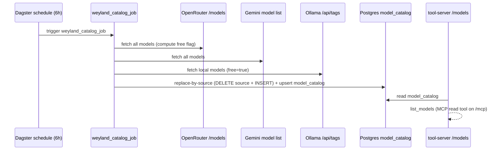

# Flow: model_catalog Refresh (B26)

Dagster keeps a Postgres registry of reachable models fresh, so `list_models` reflects what's routable —
without a live fetch on every call. Scheduled (6h, cron `0 */6`) and idempotent. It fetches **all** models
from three sources and records a per-row `free` boolean (no free-filtering); pruning is replace-by-source
(`DELETE WHERE source=… ` then re-INSERT).

