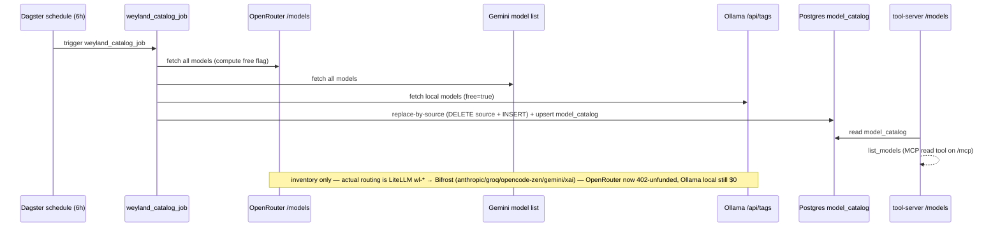

# Flow: model_catalog Refresh (B26)

Dagster keeps a Postgres registry of reachable models fresh, so `list_models` reflects what exists —
without a live fetch on every call. Scheduled (6h, cron `0 */6`) and idempotent. It fetches **all** models
from three inventory sources (OpenRouter / Gemini / local Ollama) and records a per-row `free` boolean (no
free-filtering); pruning is replace-by-source (`DELETE WHERE source=… ` then re-INSERT). This is an
**inventory table**, distinct from what's actually routed: production traffic goes through **LiteLLM's `wl-*`
aliases**, whose hosted rungs egress via **Bifrost** (Anthropic / Groq / opencode-zen / Gemini / xAI) with
Ollama local direct. OpenRouter is now **402-unfunded** (kept as a catalog source, no longer a funded route);
Ollama local is still valid $0. See [llm-routing.md](../llm-routing.md).

