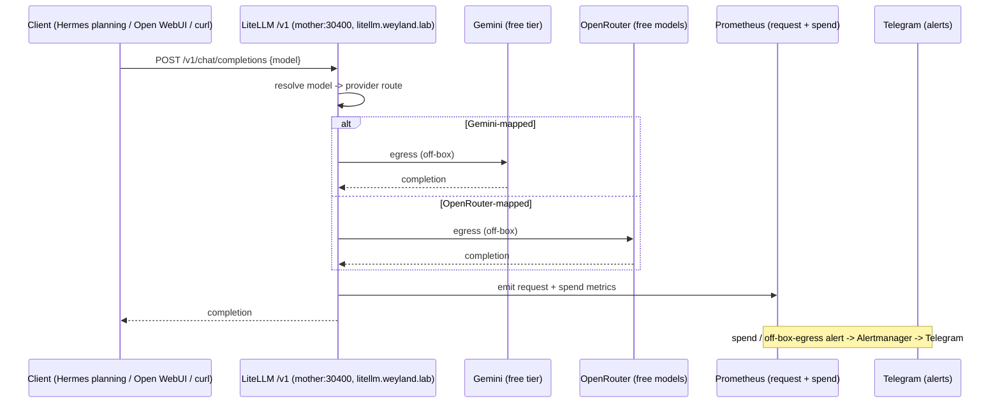

# Flow: Model-Gateway Routing (B26, LiteLLM)

Hosted-model calls go through **LiteLLM on mother**, never direct from clients. Free tiers only (Gemini +
OpenRouter wildcard). Off-box egress is a deliberate valve with spend alerts; Hermes' local lanes (Ollama)
never leave the box and bypass this entirely.

