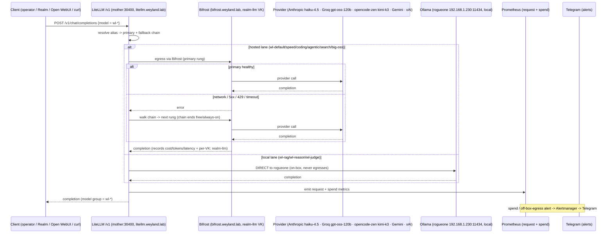

# Flow: Model-Gateway Routing (B26 → B111, LiteLLM use-case router)

Hosted-model calls go through **LiteLLM on mother**, never direct from clients. LiteLLM is the platform's
**use-case router**: a client sends only a `wl-*` alias (`wl-default`/`speed`/`coding`/`agentic`/`rag`/`reason`/
`judge`/`search`/`big-oss`) and LiteLLM resolves it to a **primary + a server-side fallback chain**, failing over
on network / 5xx / 429 / timeout down to a free, always-on rung. **Hosted lanes egress THROUGH Bifrost**
(2026-08-01): `LiteLLM → Bifrost → provider` (Anthropic `claude-haiku-4-5` / Groq `gpt-oss-120b` / opencode-zen
`kimi-k3` / Gemini / xAI); Bifrost records provider cost/tokens/latency + per-VK attribution (`realm-llm` VK). The
**local Ollama lanes** (`wl-rag`/`wl-reason`/`wl-judge`) stay **DIRECT** to rogueone and never leave the box. See
[llm-routing.md](../llm-routing.md), [runbooks/model-gateway.md](../runbooks/model-gateway.md).

