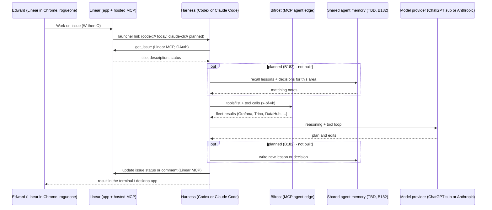

# Flow: Multi-Harness — Linear issue → any harness → shared platform (B181 live, B182 shared memory planned)

One Linear issue can be worked by **more than one harness** against the same platform. The live path today (verified
2026-09-25): Linear's "Work on issue" launcher hands the issue to **Codex** (`codex://` → ChatGPT desktop), and Codex
reads the full issue through **Linear's hosted MCP** and the lab's tools through **Bifrost**; **Claude Code** reaches
the same two MCP servers. The **shared agent memory** step is **planned (B182)** — store, transport and gateway are all
TBD, so it is drawn as an optional block, not a live call. See [concepts/multi-harness.md](../concepts/multi-harness.md),
[design/shared-agent-memory-design.md](../design/shared-agent-memory-design.md).

**Why this shape.** Every shared concern sits behind a protocol every harness already speaks (MCP), so adding a
harness is one config entry, not an integration: Linear and Bifrost are live, memory is the missing third. Keeping
memory per-harness (the status quo) means a lesson learned in Claude Code is invisible to Codex — the drift B182 exists
to remove. Runbook: [runbooks/coding-agents.md](../runbooks/coding-agents.md) (Codex + Linear, the bubblewrap fix).
