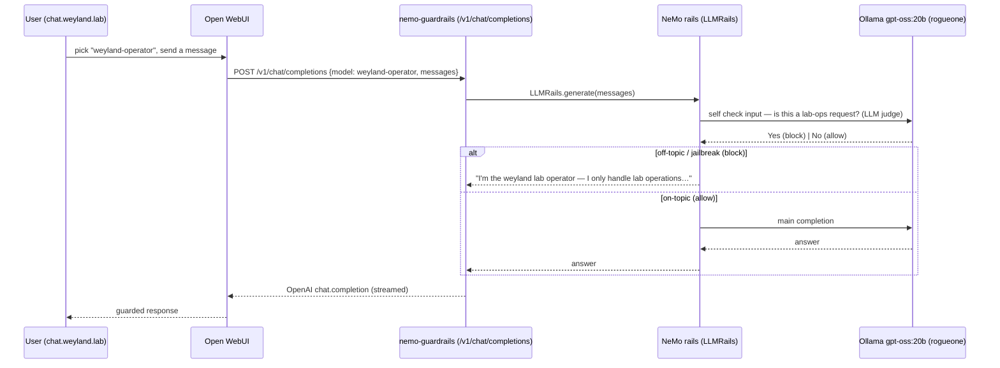

# Flow: NeMo Dialog Guard (B115 — the guarded `weyland-operator` chat model)

The **Dialog** layer of the guardrails platform. Open WebUI offers a guarded **`weyland-operator`** model (an OpenAI
connection to `nemo-guardrails`) alongside the raw Ollama models. NeMo applies the input + topical rails via
`self check input` (an LLM judge — the Colang dialog rail wouldn't fire); off-domain / jailbreak requests are refused
with the operator message, on-topic passes to the main model. See [runbooks/guardrails.md](../runbooks/guardrails.md).

