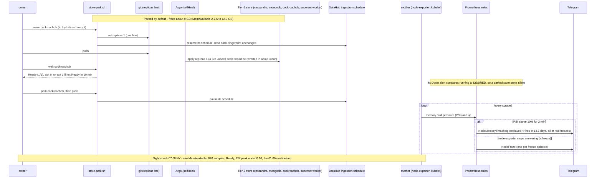

# Flow: keeping mother out of overnight memory stalls (B199)

mother (78 Gi, no swap) ran so close to its memory ceiling that an overnight job plus a CI run tipped it into
page-cache thrash: node-exporter went silent, the Woodpecker agents lost the API server, CI runs died with `task
expired`, and once the node went NotReady. The fix has three parts:
- **Make room:** four idle Tier-2 stores are parked by default (replicas 0 in git), switched only through git by
  `store-park.sh`.
- **See a stall:** a memory-pressure alert (`NodeMemoryThrashing`) and a scrape-gap alert (`NodeFroze`).
- **Prove it held:** a nightly check against written thresholds.

See [runbooks/node-capacity.md](../runbooks/node-capacity.md) and [demos/node-memory.md](../demos/node-memory.md).

