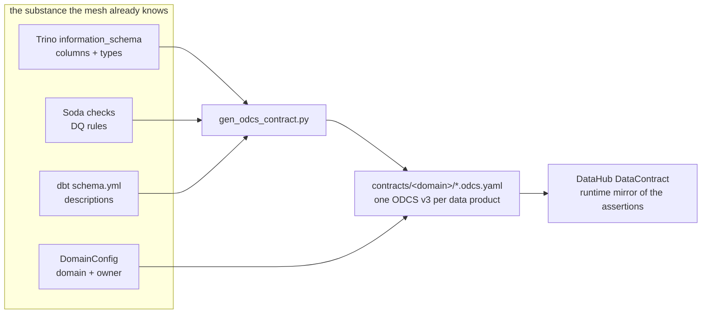
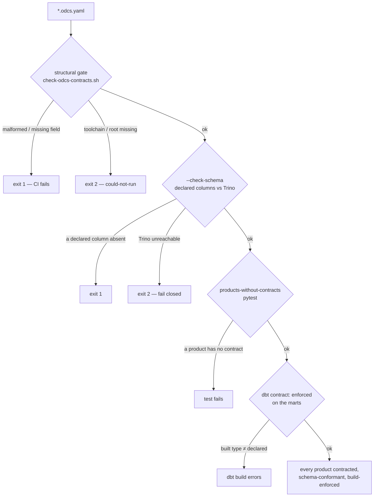

# Flow — ODCS data contracts (B157): one standard, three gates

The mesh had contract SUBSTANCE scattered across dbt tests, Soda checks, and DataHub DataContracts, but no
single declarative standard and nothing that FAILED on a malformed contract. B157 adopts ODCS (a lab subset)
and gates it. See the decision doc [data-contracts-odcs.md](../concepts/data-contracts-odcs.md) and the demo
[odcs-contracts.md](../demos/odcs-contracts.md).

## From scattered substance to one contract

ODCS is the **declarative source** (what is promised); the DataHub DataContract is the **runtime mirror**
(whether it currently holds). Complementary, not redundant.

## Three gates, from cheap to live

- **Structural** (`check-odcs-contracts.sh`, 10 bats) runs in CI — no cluster.
- **Live column conformance** (`--check-schema`) asserts each declared column exists in the Trino physical
  table — runs at close-out (needs the cluster); validated 2026-09-05, all 10 conform, a bogus column caught.
- **Products-without-contracts** (`test_product_contract_coverage.py`) fails if a Music/Health/Finance
  product has no contract — 10/10 covered.
- **dbt `contract: enforced`** on the finance marts catches a schema change at `dbt build` — confirmed live
  (`dbt build`, PASS=16, ERROR=0).
