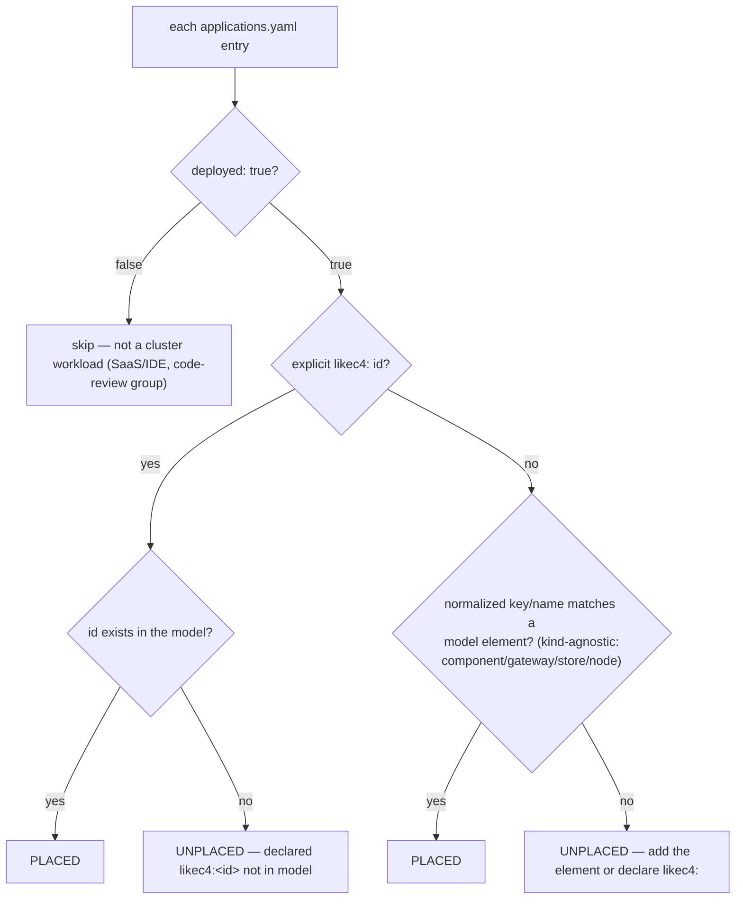
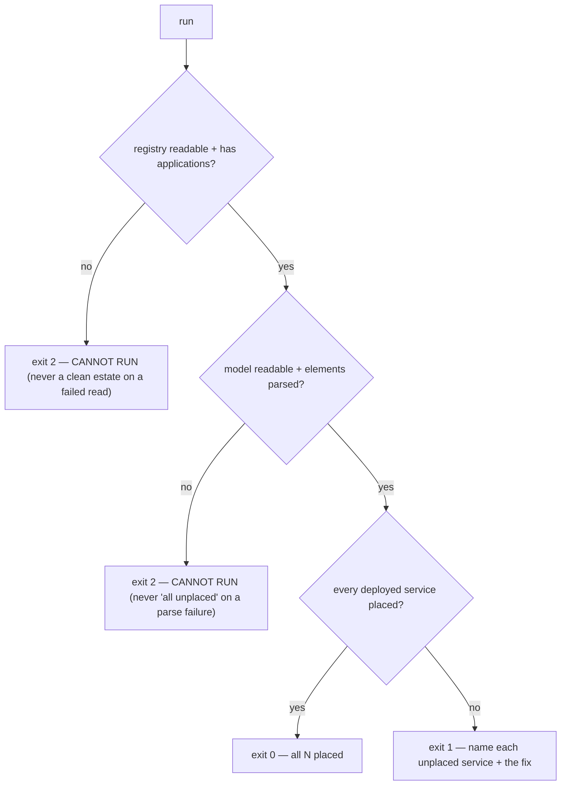
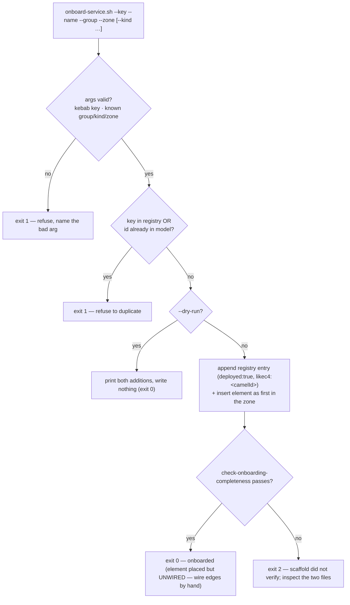

# Flow — onboarding-completeness guard (B154 Phase 1a)

The coverage family proves a service is scraped / visualized / alerted / cataloged / registered. This
guard proves the surface none of them cover: a **deployed** service is **placed** in the single LikeC4
model. Concept: [application-catalog.md](../concepts/application-catalog.md); demo:
[onboarding-completeness.md](../demos/onboarding-completeness.md). The guard itself is repo tooling
(LikeC4 N/A); the 3 elements it forced into the model on first run are the drift it found.

## Per-service resolution (declared → matched → placed?)

## Fail-closed exit contract

- **Declarative contract, not fuzzy guessing:** `deployed: true|false` is declared per service; placement
  resolves by an explicit `likec4: <id>` (authoritative — for a subsumed/renamed element) else a
  normalized key/name match. A new service that matches nothing is nudged to add the element or declare
  the id — which is exactly the onboarding step that was silently skippable before.
- **Fail closed:** exit 1 = a defect (an unplaced deployed service, named); exit 2 = the guard could not
  run (registry/model unreadable or empty) — never conflated with a clean estate, the coverage-guard rule.
- **What it caught on first run:** `weyland-agent`, `port-k8s-exporter`, `promptfoo` were deployed but
  absent from the model; all three were added (fix-don't-file) so the live invariant now holds (59/59).

## The scaffolder — landing paved instead of auditing into compliance (Phase 1b)

`scripts/onboard-service.sh` is the other half of the paved road: it writes the two surfaces the guard
checks, from one command, so a new service starts onboarded-complete.

- **Id = camelCase(key)**, written as an explicit `likec4:` on the entry AND as the element id, so the
  guard resolves it two ways. The tool refuses a duplicate key or id, validates the group/kind/zone
  against the real files, and `--dry-run` shows exactly what it would write.
- **Honest boundary:** it *places* the element but never invents relationships — wiring edges is a human
  judgement the scaffold leaves as a stated follow-up, not a guess.
