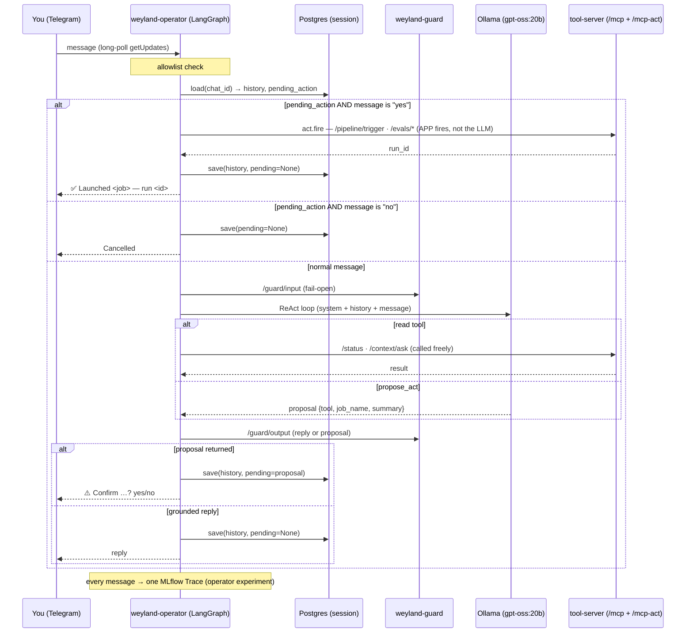

# Flow: Operator agent (`weyland-operator`, B66)

Text the lab from anywhere → it acts. A LangGraph ReAct agent (`gpt-oss:20b`) over the tool-server's read + act tools,
fronted by **Telegram long-poll**, with **per-chat Postgres session memory** and an **app-level confirm-step** on every
state-changing action (the operator lane Hermes vacated). Read tools are called freely; act tools are **PROPOSE-only** —
the LLM proposes, the user confirms, the *app* fires. See [demos/operator.md](../demos/operator.md) +
[runbooks/operator.md](../runbooks/operator.md).

