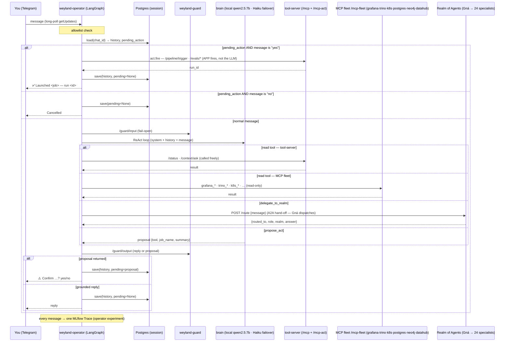

# Flow: Operator agent (`weyland-operator`, B66)

Text the lab from anywhere → it acts. A LangGraph ReAct agent — **local `qwen2.5:7b` primary with Haiku failover**
(see [flow-operator-brain.md](flow-operator-brain.md)) — over the tool-server's read + act tools **plus the read-only MCP fleet** (`/mcp-fleet`) **and a `delegate_to_realm`
hand-off to the Realm of Agents** (B17 A2A), fronted by **Telegram long-poll**, with **per-chat Postgres session
memory** and an **app-level confirm-step** on every state-changing action (the operator lane Hermes vacated). Read
tools and Realm delegation are called freely; act tools are **PROPOSE-only** — the LLM proposes, the user confirms,
the *app* fires. See [demos/operator.md](../demos/operator.md), [runbooks/operator.md](../runbooks/operator.md),
[runbooks/mcp-fleet.md](../runbooks/mcp-fleet.md), [demos/realm-of-agents.md](../demos/realm-of-agents.md),
[flow-operator-brain.md](flow-operator-brain.md), [flow-incident-sweep.md](flow-incident-sweep.md).

