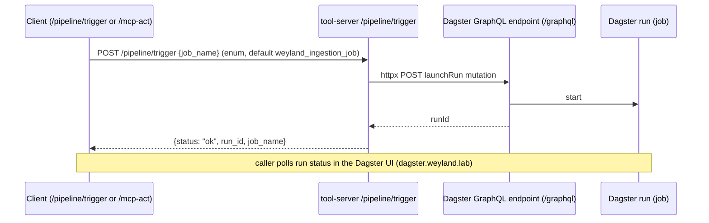

# Flow: Pipeline Trigger (`/pipeline/trigger` → Dagster)

How an API/agent call kicks a Dagster run (e.g. on-demand ingestion). The agent path audits this as an
act-tool (see [flow-act-tool.md](flow-act-tool.md)); this diagram is the launch mechanism itself. `job_name`
is an enum of the three jobs, defaulting to `weyland_ingestion_job`. The run proceeds independently (e.g.
[flow-ingestion.md](flow-ingestion.md)); the caller just gets the run id back.

