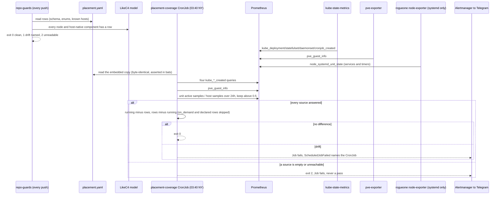
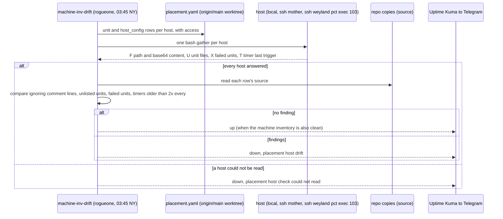

# Flow — placement inventory check (B198, host check B180)

How `placement.yaml` stays true. On every push, `repo-guards` runs the repo check against the file and the LikeC4
model. Every night at 03:40 NY the `placement-coverage` CronJob runs the live check: it reads three families of series
from Prometheus (Kubernetes workloads from kube-state-metrics, Proxmox guests from pve-exporter, rogueone's active
systemd units from its systemd-only node-exporter over the last 24h) and compares them with the rows. Anything
running without a row, or a row naming nothing running, fails the Job and pages. Operate:
[runbooks/observability.md](../runbooks/observability.md#placement-inventory--placementyaml-and-its-checks-b198-2026-09-27).

**Host check (B180).** Nightly on rogueone, inside `machine-inv-drift` (03:45 NY), `placement_check.py --hosts` reads
every host over its `access` path and compares the installed unit and config files with their repo copies. The
result joins the machine-inventory result in one Kuma heartbeat.

