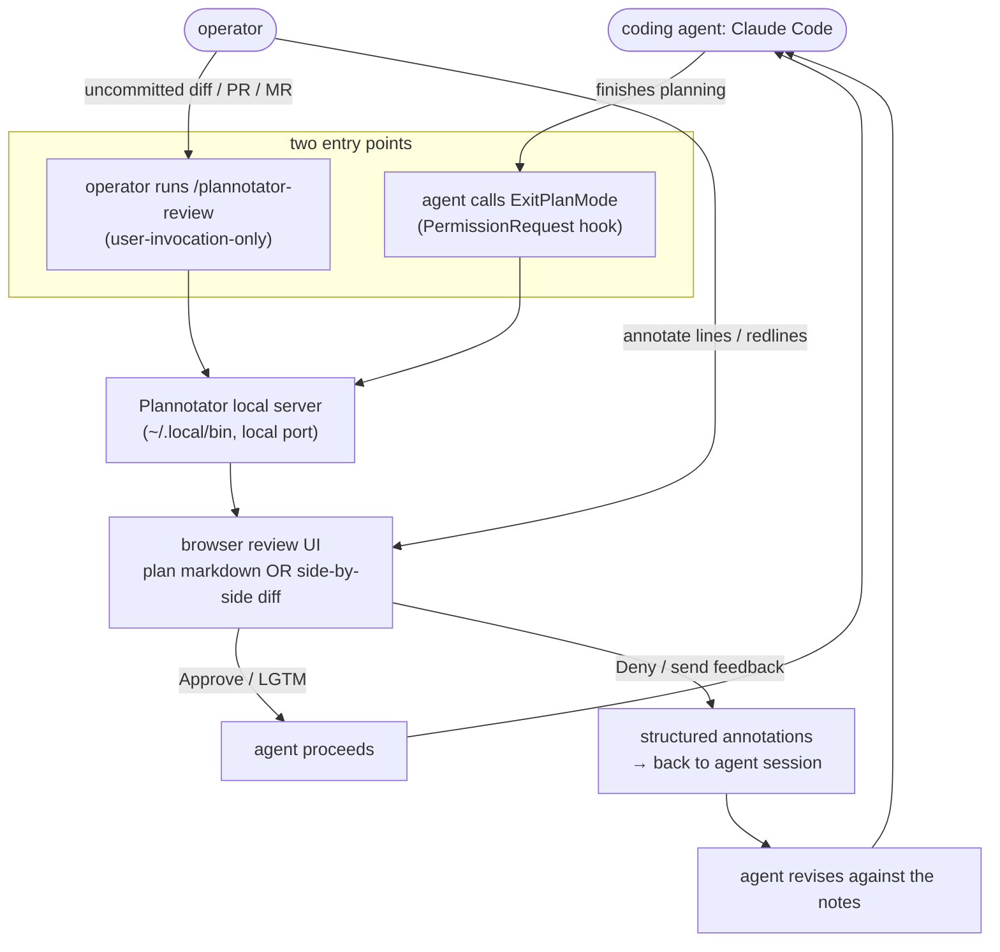

# Flow: Plannotator — plan + diff review round-trip (B167)

Plannotator (`backnotprop/plannotator`, MIT/Apache-2.0) is a **local** human review surface for coding agents.
Two entry points — the agent-initiated **plan review** (hooks `ExitPlanMode`) and the human-initiated **diff
review** (`/plannotator-review`) — both open a browser UI served by a local process, take annotations, and feed
them back to the agent. Workstation tool (beside the agent on rogueone), no cluster footprint. Eval:
[../concepts/plannotator-eval.md](../concepts/plannotator-eval.md); ops: [../runbooks/plannotator.md](../runbooks/plannotator.md).

- **Plan review** is the flagship: it intercepts Claude Code's native `ExitPlanMode` gate, so the plan-approval
  step becomes an annotatable page instead of a wall of terminal text. **Deny** returns the annotations as
  structured feedback and the agent revises.
- **Diff review** covers written code (uncommitted changes or a PR/MR) with line-level annotation and a one-click
  round-trip back to the session.
- **Local by default** — set `PLANNOTATOR_AI=disabled` + `PLANNOTATOR_SHARE=disabled` to keep every byte on the
  LAN (only Ask-AI and link-sharing would egress otherwise).
