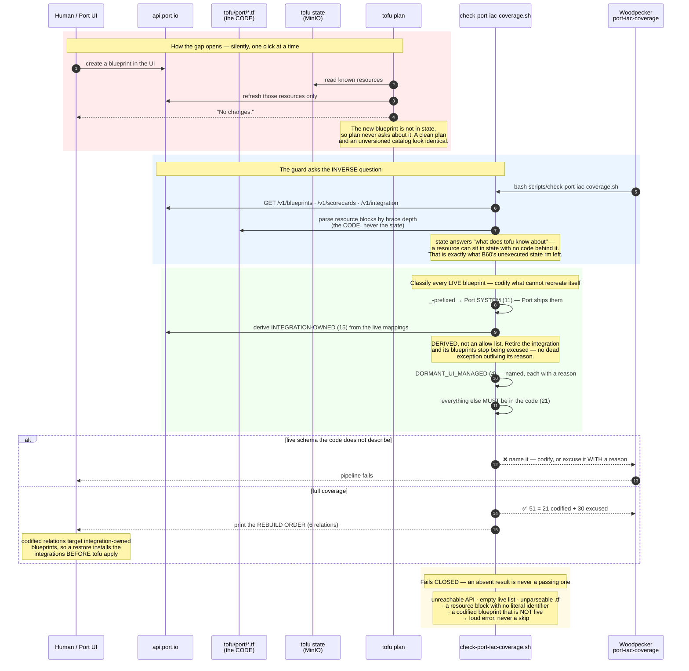

# Flow — Port IaC coverage (B137): the question `tofu plan` cannot ask

How Port's schema is kept under OpenTofu, and why a separate guard is needed to prove it. Sequence (Mermaid);
architecture placement in `arch.md` §6 (OpenTofu row) + [runbooks/port.md](../runbooks/port.md) § What is
deliberately UI-managed. Demo: [demos/port-iac-coverage.md](../demos/port-iac-coverage.md).

**The problem in one line:** `tofu plan` compares the code to the resources **tofu knows about**, so a blueprint
someone created in Port's UI is invisible to it — "no changes" and "half the catalog is unversioned" are the same
output. That is how the org reached 51 live blueprints against 13 codified over two months with a clean plan
throughout.

**The invariant:** every blueprint, scorecard and integration live in Port is either **in the code** or **excused by
one of three stated reasons**, and the excuse for the largest group is *derived from the live system* rather than
written down — so it expires on its own when the integration that justified it goes away.

**Why the excuses exist at all.** An Ocean integration creates its blueprints on install and **revises them on
upgrade** — github-ocean moved 6.8.1 → 6.9.4 in two days here. If tofu owned `githubRepository`, every upgrade
would read as drift and an apply would revert the integration's own schema, reintroducing the permanently-dirty
plan this whole item exists to cure.

Covered by 18 bats tests in `scripts/tests/port-iac-coverage.bats`, each verified by mutation — including one that
was vacuous on the first pass (the nested-identifier fixture put the decoy *after* the real value, so deleting the
parser's depth check kept it green).
