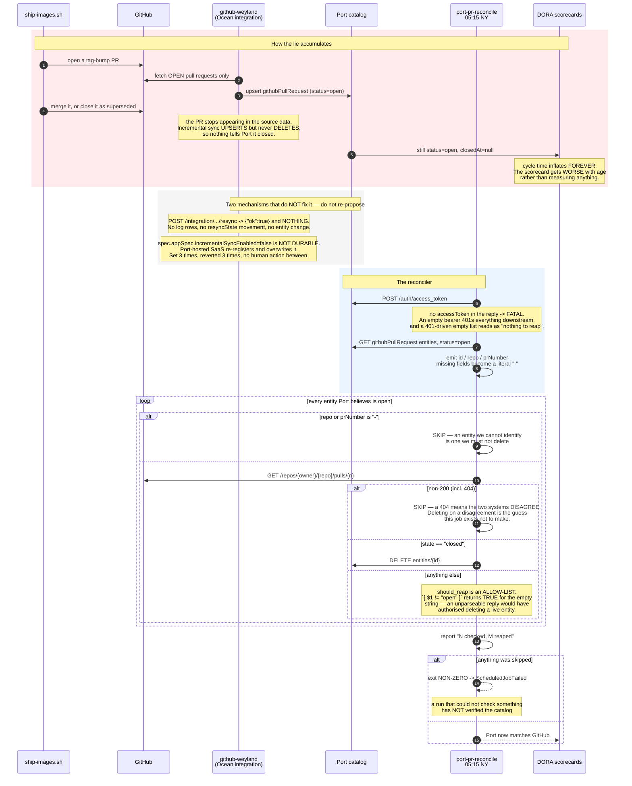

# Flow — Port PR entity reconciliation (B144): the reaper the integration doesn't have

How closed pull requests get removed from Port's catalog, and why every step refuses to act on an
uncertain answer. Sequence (Mermaid); operations in
[runbooks/pr-lifecycle.md](../runbooks/pr-lifecycle.md) § Reaping stale Port PR entities.
Demo: [demos/port-pr-reconcile.md](../demos/port-pr-reconcile.md).

**The gap in one line:** `github-weyland` fetches **only open PRs**, so a PR that closes stops appearing
in the source data — and an incremental sync **upserts but never deletes**. The entity survives forever
claiming `status: open`.

**The invariant:** an entity is deleted only on a **positive** `closed` from a **200** response about a PR
whose repo and number Port could state. Every other path — unreachable API, unparseable body, missing
field, 404, unrecognised state — skips the entity and fails the run.

**Why the failure rule matters more than the freshness rule here.** Because it fails closed, a broken run
exits non-zero having reaped *nothing* while the catalog keeps accumulating stale rows. Freshness alone
would stay quiet as long as some later run succeeded, so `ScheduledJobFailed` is the one that catches it
(`k8s/monitoring/cron-freshness-rules.yaml`).

Covered by 19 bats tests in `scripts/tests/port-pr-reconcile.bats`, the majority of which assert that
**nothing was deleted** — the weighting matches the risk, since this is the only job in `pr-lifecycle/`
whose worst failure destroys data rather than missing a page.
