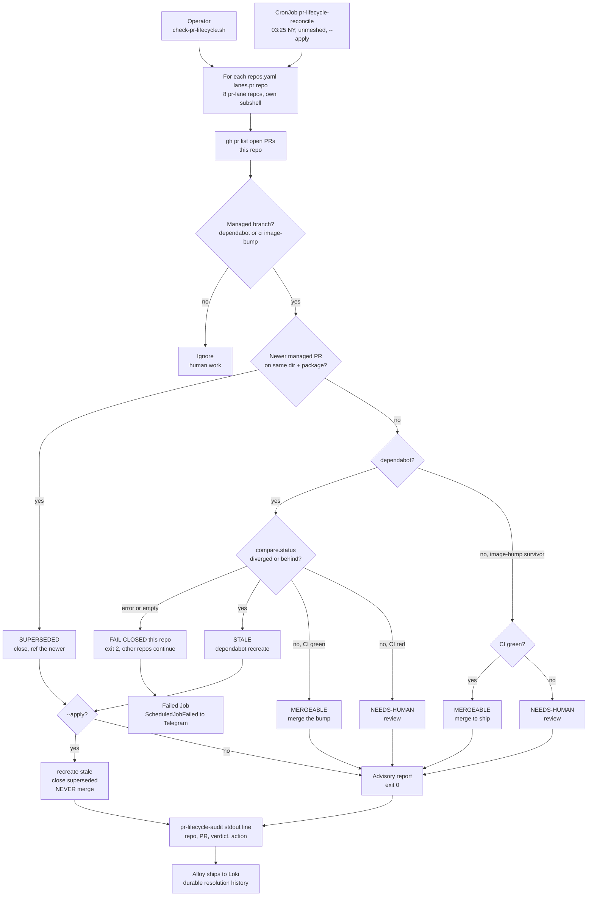

# Flow: open-PR reconcile (B131 resolution half)

How `scripts/check-pr-lifecycle.sh` resolves open managed PRs. The three `pr-lifecycle/` watchdogs SURFACE
(alert, or reap a stale Port entity); this one RESOLVES. Runbook:
[runbooks/pr-lifecycle.md](../runbooks/pr-lifecycle.md) § "Resolving open PRs" · concept:
[concepts/linear-evaluation.md](../concepts/linear-evaluation.md).

`STALE` never merges — a stale dependabot branch carries pre-remediation pins, so merging can silently
downgrade a hand-remediated CVE. `@dependabot recreate` re-cuts against current main and cannot regress.
Advisory by default; `--apply` performs only the low-risk resolutions (recreate, close) and **never merges**.

The reconciler fans out over **every `repos.yaml` `lanes.pr: true` repo** (8 today), each in its own subshell
so one repo's `compare`/auth failure fails *that* repo (exit 2 → Telegram) without shrinking the watch set.
Every classification and mutation is emitted as a structured `pr-lifecycle-audit` line → **Alloy → Loki**, the
durable audit trail (LogQL in [runbooks/pr-lifecycle.md](../runbooks/pr-lifecycle.md)).
