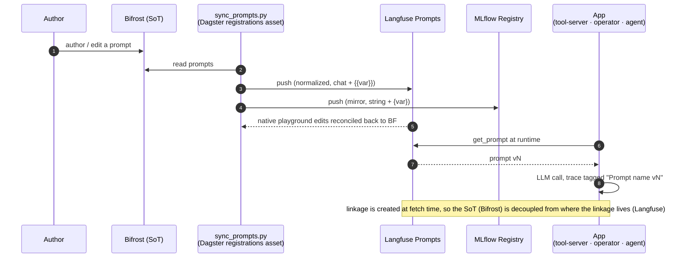

# Flow: Prompt federation — one SoT for prompts + measurement (B103)

Bifrost is the single source of truth; `sync_prompts.py` mirrors every prompt OUT to Langfuse + MLflow (bidirectional,
idempotent), and apps fetch from Langfuse at runtime — so each LLM trace is tagged with the exact prompt version.

Demo: [demos/prompt-federation.md](../demos/prompt-federation.md).
