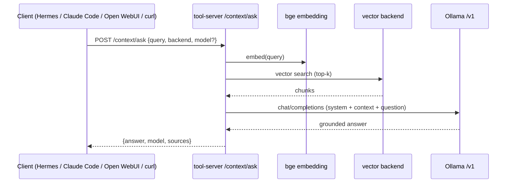

# Flow: RAG Query (`/context/ask`)

```mermaid
sequenceDiagram
    participant Client as Client (Hermes / Claude Code / Open WebUI / curl)
    participant TS as tool-server /context/ask
    participant Emb as bge embedding
    participant Back as vector backend
    participant OLL as Ollama /v1
    Client->>TS: POST /context/ask {query, backend, model?}
    TS->>Emb: embed(query)
    TS->>Back: vector search (top-k)
    Back-->>TS: chunks
    TS->>OLL: chat/completions (system + context + question)
    OLL-->>TS: grounded answer
    TS-->>Client: {answer, model, sources}
```
