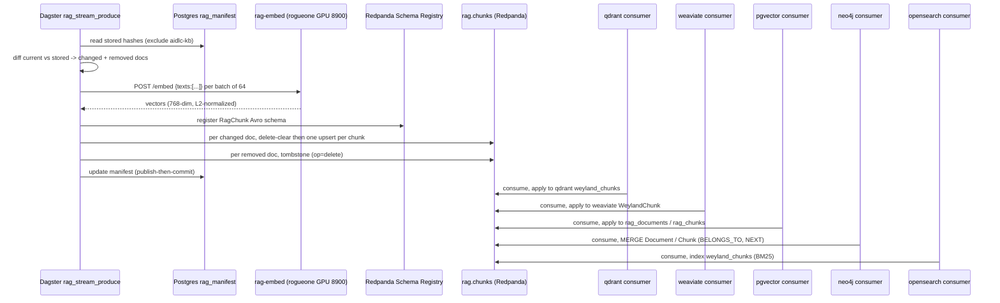

# Flow — RAG streaming indexer (B-RAG-STREAM)

The RAG index is built by a **streaming fan-out**, not an in-process Dagster asset chain. Dagster is the control
plane: a `rag_stream_produce` op chunks the changed docs, embeds them **once** on the warm rogueone GPU service,
and publishes `RagChunk` records (Confluent-Avro) to the Redpanda topic **`rag.chunks`** (keyed by
`source_path`). Five independent consumers — one per store, one consumer group each — replay that topic into
their own store (qdrant, weaviate, pgvector, neo4j, opensearch). Only the manifest + record stream cross Dagster;
the vectors never do (design invariants I1–I3, I6). See
[../../aidlc-docs/construction/rag-streaming-indexer-design.md](../../aidlc-docs/construction/rag-streaming-indexer-design.md)
and [../demos/rag-stream.md](../demos/rag-stream.md).

Two record types share one Avro schema, discriminated by `op`:
- `upsert` — one chunk (text + 768-dim vector, bge-base) into a store.
- `delete` — clear all of a doc's rows. Emitted BOTH as the replace-clear before a changed doc's new chunks AND
  as the tombstone for a removed doc. `source_path` partition-keying orders a doc's delete before its upserts.

`rag_manifest` (the op's own Postgres table) holds change-detection + prune state, decoupled from the pgvector
store's `rag_documents` (design §3.2b). `aidlc-kb/` paths are structurally excluded, so the KB corpus can never
be tombstoned.

## Sequence

**Why streaming, not a Dagster asset chain:** the old `embeddings` asset was one `list[dict]` holding every
chunk's text + vector, pickled whole and re-read once per writer — the sentence-transformer plus the full vector
set lived in the orchestrator's process and OOMKilled the shared `dagster-user-code` pod. Moving embed to a warm
GPU service and the fan-out to Redpanda makes peak memory bounded by one batch, gives per-store failure isolation
+ independent retry (reset one group's offset to rebuild one store), and turns prune into a replayable tombstone
instead of a whole-state scan.
