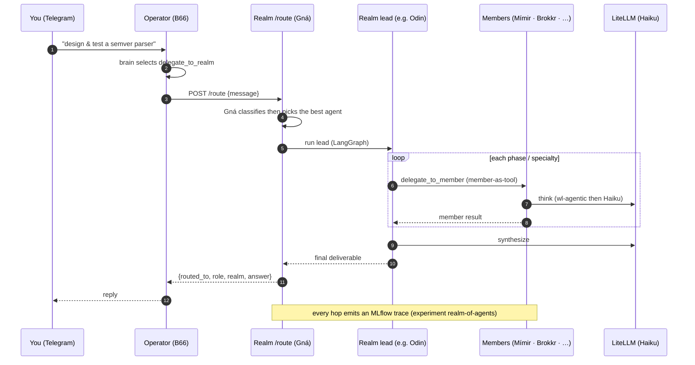

# Flow: Realm of Agents — A2A dispatch (B17)

24 corpus-backed specialists in five Norse-named groups behind an A2A surface. Gná routes a task to the best agent;
leads act on their own specialty or delegate to their team and reconcile. The Operator reaches the Realm through a
single `delegate_to_realm` tool. Every agent runs on Claude Haiku (`wl-agentic` LiteLLM lane); every hop is an MLflow trace.

Demo: [demos/realm-of-agents.md](../demos/realm-of-agents.md). Concept: [concepts/realm-of-agents.md](../concepts/realm-of-agents.md).
