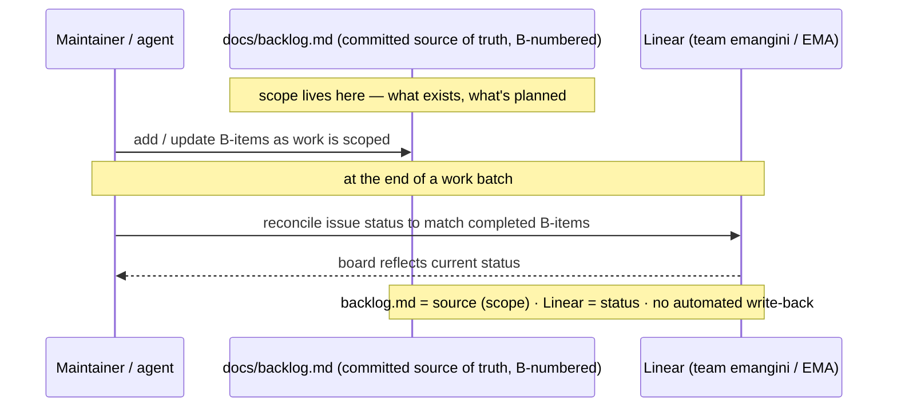

# Flow: Roadmap Sync — `docs/backlog.md` ↔ Linear (EMA)

Roadmap and issues live in **Linear** (team `emangini` / **EMA**), but the **committed `docs/backlog.md`** (B-numbered,
in git) is the **single source of truth** for scope. The two are reconciled at the **end of a work batch**: `backlog.md`
drives *what exists and what's planned*, Linear tracks *status*. There is **no automated write-back** — the sync is a
manual / agent step.

> **Owner review:** this diagram captures the current *mechanism* (backlog.md = source, Linear = status, synced
> end-of-batch). If a scripted or scheduled sync exists, wire its exact trigger/cadence in here.
