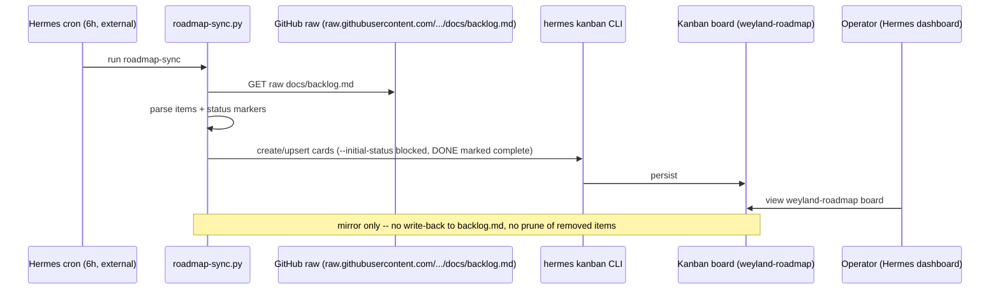

# Flow: Roadmap-Sync → Hermes Kanban (B27)

Hermes mirrors `docs/backlog.md` into its Kanban as a **one-way, read-only** board (`weyland-roadmap`). Every
card is parked at `--initial-status blocked` so the dispatcher never actions it (DONE items are marked
complete); the backlog stays the single source of truth and the script **never writes back**. This is distinct
from Hermes' *self-management* board, which the agent does own. The 6h cadence is external (cron/manual) — the
script itself does no scheduling, and it has **no prune step** (items dropped from the backlog are simply skipped,
not deleted).

