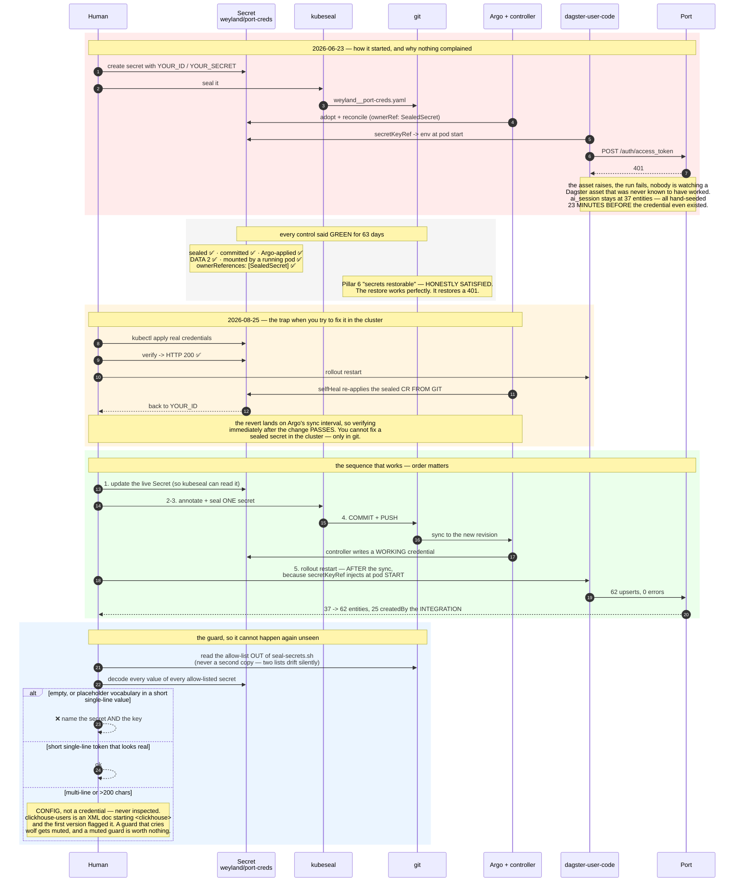

# Flow — the sealed placeholder (B147): how a credential can be perfectly restorable and authenticate to nothing

The failure that hid for 63 days, why every control reported green, and the guard that closes it.
Sequence (Mermaid); operations in [runbooks/secrets.md](../runbooks/secrets.md) § The placeholder guard.
Demo: [demos/secret-placeholders.md](../demos/secret-placeholders.md).

**The shape in one line:** DoD Pillar 6 asks whether secrets are **restorable**. `port-creds` was — a full
restore faithfully reproduced `YOUR_ID` / `YOUR_SECRET`, which authenticates to nothing.

**The invariant:** every credential in the sealed allow-list is decoded and looked at, and anything that is
empty or reads as a placeholder fails the run by name — unless it carries a written exception stating the
condition that makes it legitimate.

**Why "restorable" was never the right question.** Pillar 6's check is structural: is the secret in git,
does Argo apply it, does the pod mount it. All three can be true of a value that is worthless. The only
check that distinguishes a credential from a placeholder is decoding it — which is why the guard does the
one thing no other control in the estate does.

Covered by 20 bats tests in `scripts/tests/secret-placeholders.bats`, including the multi-line and XML
cases that broke the first implementation.
