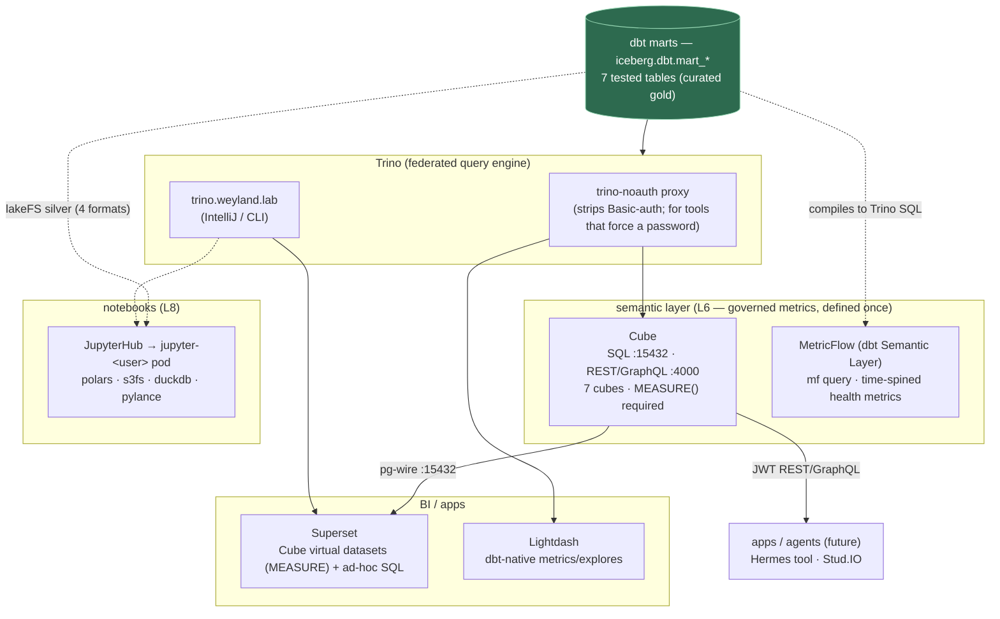
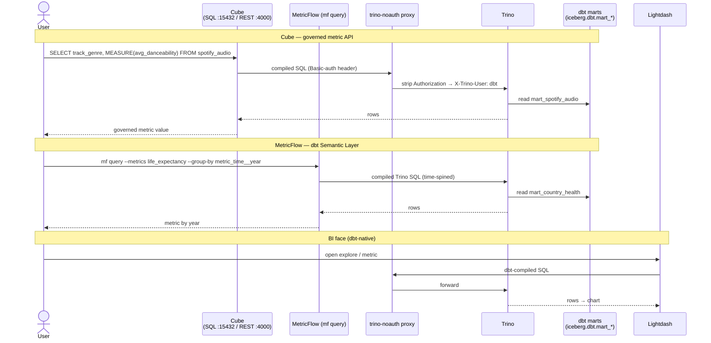

# Flow — Semantic + consumption layer (marts → Cube / MetricFlow → BI / notebooks)

The "last mile" of the mesh: how the **7 dbt marts** (the curated gold, in `iceberg.dbt`) reach a human or an app.
Two governed-metric paths (**Cube** L6, **MetricFlow**) plus the direct BI/notebook consumers. Everything routes to
Trino — the marts are Iceberg tables, Trino is the one engine that reads them. See
[query/cube.md](../query/cube.md), [runbooks/cube.md](../runbooks/cube.md),
[runbooks/jupyterhub.md](../runbooks/jupyterhub.md), `[[cube-semantic-layer-b1.7]]`.

## The two governed-metric paths (and why two)

Both let you **define a metric once** instead of re-deriving `AVG(danceability)` in every chart — but they serve
different consumers:

- **Cube (L6)** — a **headless API** (SQL / REST / GraphQL). Any pg client or app hits it; the SQL API's one rule is
  `MEASURE(measure)` (a bare measure column is rejected). Superset consumes it via `MEASURE()` virtual datasets. It's
  the metric layer an *application or agent* calls. Connects to Trino through the `trino-noauth` proxy.
- **MetricFlow** — the **dbt Semantic Layer** built into the dbt project (`semantic_models.yml`). Metrics compile to
  Trino and are queried with `mf query`. Needs a DAY time-spine (`metricflow_time_spine`), so it's scoped to the
  **time-shaped health marts** (`year` → a date axis); the categorical music marts aren't a fit. It's the metric
  layer a *dbt/analytics workflow* calls.

## The direct consumers (no semantic layer)

- **Superset** — reads Cube (governed) AND raw Trino tables (ad-hoc SQL Lab). The Cube dashboard is seeded by
  `scripts/superset_seed_cube.py`.
- **Lightdash** — dbt-native BI; its own metrics/explores over the marts, via `trino-noauth`.
- **JupyterHub (L8)** — on-demand JupyterLab pods read the marts either through Trino OR straight from the **lakeFS
  silver** in all 4 formats (Parquet/Arrow/Avro/Lance) with the baked polars/duckdb toolkit. This is the
  code-first, exploratory consumer — no metric governance, full flexibility.

## Why it all funnels through Trino

The marts are **Iceberg tables on Nessie** — there's no separate serving DB. Trino is the read path for every
consumer, so the semantic layers (Cube, MetricFlow) and BI tools all connect to Trino (Cube/Lightdash via the
`trino-noauth` auth-strip proxy, since both force a password that no-auth Trino would 401). JupyterHub is the one
consumer that can *also* bypass Trino and read the lakeFS object store directly — useful when you want the raw file,
not a query result.

## Sequence

A governed metric served two ways (Cube API, MetricFlow) and a BI face — all compiling to Trino over the marts.
Demo: [demos/semantic-consumption.md](../demos/semantic-consumption.md).

