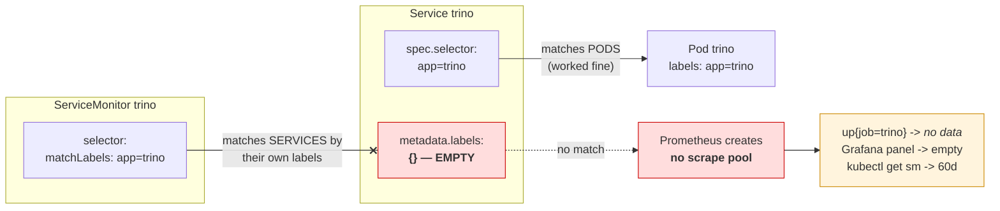
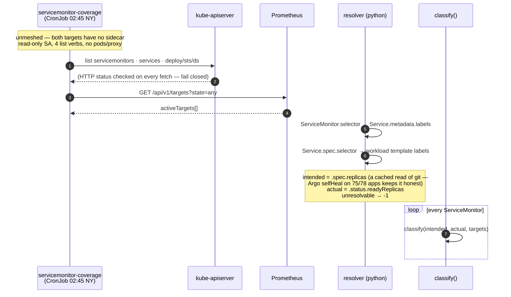
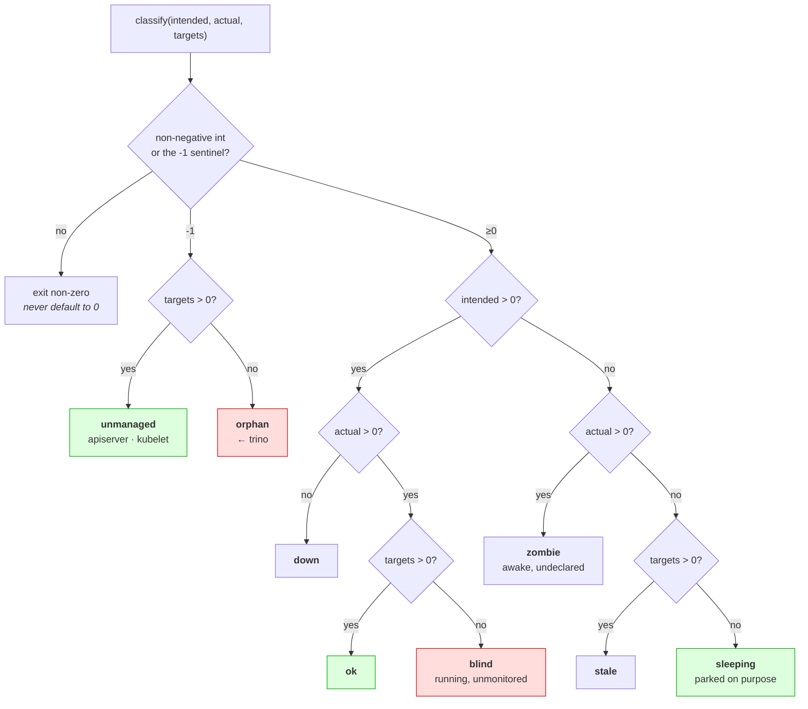

# Flow — ServiceMonitor coverage (B148): three planes, one verdict

Why a binary "is it scraping?" check could not have caught `data-mesh/trino`, and what replaced it.
Sequence + decision matrix (Mermaid); architecture placement is in `arch.md` + the LikeC4 model.

## The bug it exists to catch

**Both selectors said `app: trino`.** One matches Services by `metadata.labels`, the other matches pods
by `spec.selector` — different objects entirely. Every affirmative check came back clean for 59 days,
because the condition produces *no series at all* rather than a bad one.

## The guard

## The decision matrix

**`actual` is never compared to `intended`.** A rolling update sits at 3/2 for a minute; that is `ok`,
not `down`. Ordering those branches the other way pages on every deploy, and a guard that pages on
every deploy gets muted — the same argument this repo keeps making about permanently-lit alerts.

**`sleeping` is why the intended plane exists.** Without it, `0 replicas` is ambiguous input rather
than an answer: deliberately parked and crashed-at-3am are byte-identical.

**The invariant:** every live ServiceMonitor lands in exactly one verdict, and an unrecognised verdict
fails closed. There is no path where the guard checks nothing and reports success.
