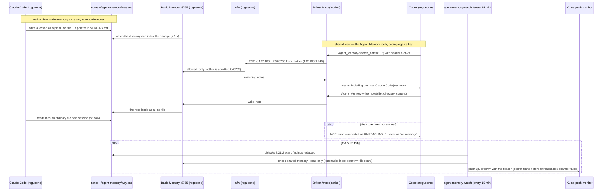
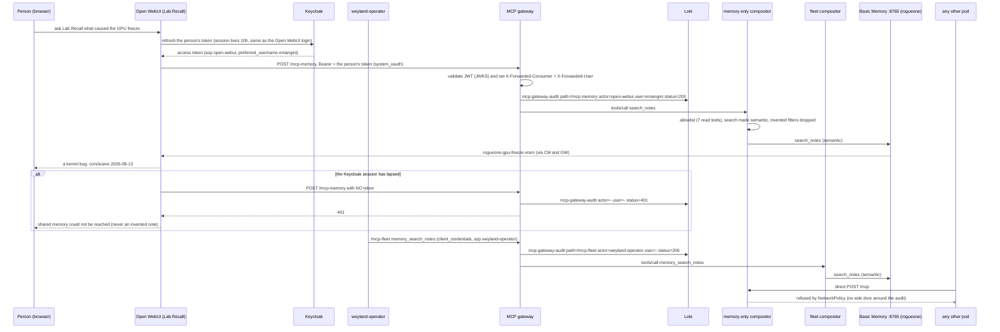

# Flow: shared agent memory — one store, two views (B182)

The store **is the directory of Markdown notes** on rogueone (`~/agent-memory/weyland`). Claude Code reads and writes
the files natively (its memory dir is a symlink to that directory). **Basic Memory** indexes the same files and serves
them over MCP, so Codex and the other agents reach them through Bifrost. No copy, no sync: a note written either way is
visible the other way in under a second (measured 2026-10-03). See
[runbooks/shared-agent-memory.md](../runbooks/shared-agent-memory.md) ·
[design/shared-agent-memory-design.md](../design/shared-agent-memory-design.md) · arch.md §8d.

**The operator recalls through its own governed path (2026-10-03):** the compositor mounts the store as a READ-ONLY
`memory` upstream — its middleware hides and refuses every memory tool except 7 read tools — so the operator gets
`memory_search_notes` etc. via the MCP gateway's `/mcp-fleet`, with its Keycloak identity, like every other read tool.
**Open WebUI recalls as the signed-in person (2026-10-04):** an MCP tool server on the gateway's `/mcp-memory`
(memory-only compositor, same 7 read tools) with `system_oauth` — the user's own Keycloak token, so the gateway sets
`X-Forwarded-User`. No shared key.

## Read-only recall — the operator and Open WebUI (2026-10-04 → 05)

Both READ through the governed MCP gateway, never Bifrost: the operator as its Keycloak client, Open WebUI as **each
signed-in person**. Every request leaves an audit line; the compositors admit no one but the gateway (and Bifrost, for
the fleet). Runbooks: [mcp-gateway.md](../runbooks/mcp-gateway.md) § Audit · [open-webui.md](../runbooks/open-webui.md).

