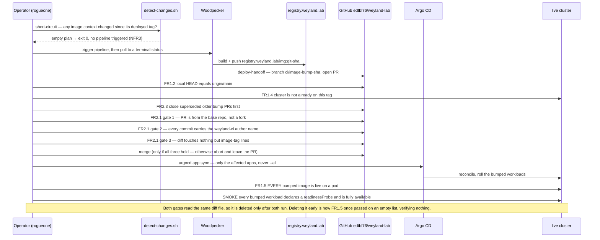
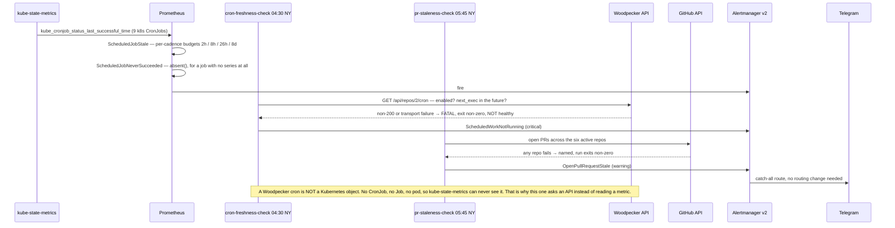

# Flow: the ship loop (B135) + the delivery watchdogs (B131)

B57a ([flow-weyland-image-ci](flow-weyland-image-ci.md)) ends at "CI opens a tag-bump PR." **Four manual steps
remained** — notice the PR, judge it safe, merge it, confirm something actually rolled — each of which fails by
simply not happening. `scripts/ship-images.sh` closes them, and the watchdogs below make the *absence* of a run
visible.

**Git is still the seam.** CI never calls `argocd sync`; the script merges a PR and then asks the live cluster what
is running. The automation replaces the human's *hands*, not the human's *checkpoint* — the checkpoint became a
machine gate that cannot be absent-mindedly waved through.

## The gates are not equally strong

Worth reading off the diagram rather than assuming three checks means three defences:

| Gate | Decided by | Strength |
|---|---|---|
| Same-repo, not a fork | **GitHub** | Unspoofable. The load-bearing one — `weyland-lab` is public with no branch protection, so this is what stands between a stranger's PR and `main` |
| `weyland-ci` author name | `git config` | A **convention**. Anyone who can write a commit can write that string. Defence in depth behind same-repo, never provenance alone |
| Tags-only diff | the script | Written as *"no line fails to match"*, so a smuggled `memory: 8Gi` fails even though the diff still contains a valid tag line |
| FR1.5 | live pods | Proves the right **bytes** are on the node — a fact about images, not about function |
| SMOKE | live workloads | Proves something **asked the application a question**. A workload with no `readinessProbe` reports `1/1 Ready` the instant PID 1 is alive |

## Watchdogs

The loop above only runs when someone runs it, and the nightly pipeline only runs if its cron is alive. Both
failure modes are **silent** — nothing errors, the work simply does not happen. The estate had 41 alert rules and
every one watched something that *was* running, which is how `nightly-images` sat `enabled: false` for four days
while `docs/schedules.md` documented it as daily.

### Why two mechanisms and not one

| | Covered by | Because |
|---|---|---|
| 9 **k8s** CronJobs | `PrometheusRule` over `kube_cronjob_status_last_successful_time` | The metric already existed and had no consumer |
| `nightly-images` | a CronJob asking the **Woodpecker API** | It is not a k8s object; no `kube_cronjob_*` metric will ever cover it |
| Open PRs | a CronJob asking the **GitHub API** | No exporter in this cluster describes a pull request |

Budgets are **per-cadence**, not one blanket threshold: a flat "no success in 24h" would false-fire on both weekly
jobs every week, and a permanently-lit alert is worse than no alert — exactly what `WeylandErrorLogSpike` was found
doing, matching `NOERROR` with `/error/`.

`cron-freshness-check` appears in its own daily budget. It is the job that detects stopped scheduled work, so its
silent failure would reopen the blind spot the rule exists to close.

## Related

- [flow-weyland-image-ci.md](flow-weyland-image-ci.md) — the B57a build half this extends
- [flow-alerting.md](flow-alerting.md) — the Alertmanager → Telegram path these ride
- [runbooks/ship-images.md](../runbooks/ship-images.md) · [runbooks/pr-lifecycle.md](../runbooks/pr-lifecycle.md)
- `arch.md` §10b — the decision matrix and the bug class behind all of this
