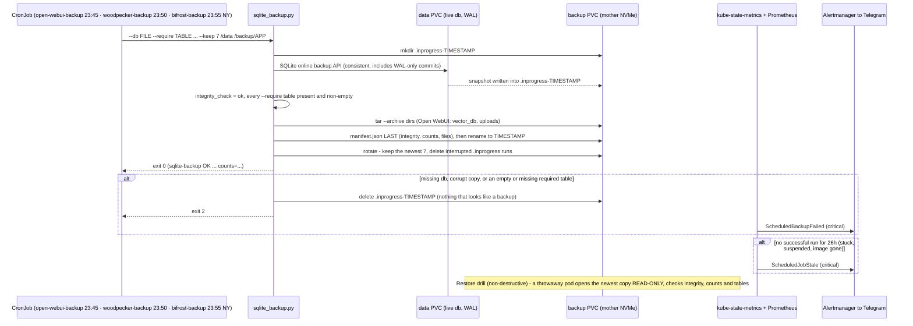

# Flow: SQLite app-store backups — Open WebUI + Woodpecker + Bifrost (2026-10-04 / 05 / 08)

Three apps keep their whole state in ONE SQLite file in WAL mode on a RWO PVC on mother: Open WebUI (`webui.db` — users,
chats, settings, presets), Woodpecker (`woodpecker.sqlite` — users, repos, CI secrets, the nightly cron, pipeline
history, step logs) and Bifrost (`config.db` — providers and keys, virtual keys and budgets, MCP clients, ~280 prompts,
~589 skills, the owned `client_config`; B202, before its v2 migration; its request-log `logs.db` is not backed up). One script, `scripts/sqlite_backup.py`, embedded byte-identical into each CronJob's ConfigMap,
backs all three up; each job declares which tables must be non-empty. A backup that proves nothing fails CLOSED and pages.
Runbooks: [open-webui.md](../runbooks/open-webui.md) · [woodpecker.md](../runbooks/woodpecker.md) § Backup + restore ·
[mcp-gateway.md](../runbooks/mcp-gateway.md) § Bifrost backup + restore ·
catalog [dr.md](../dr.md) · demo [sqlite-backups.md](../demos/sqlite-backups.md).

**Woodpecker's database lock fix rides the same store (B201).** `WOODPECKER_DATABASE_MAX_CONNECTIONS: '1'` makes
Woodpecker queue its own writes (metrics, cron list, lease extensions, step logs) instead of racing inside SQLite; the
Loki ruler pages `WoodpeckerDatabaseLocked` / `WoodpeckerTaskExpired` if a lock or a killed run ever returns.
