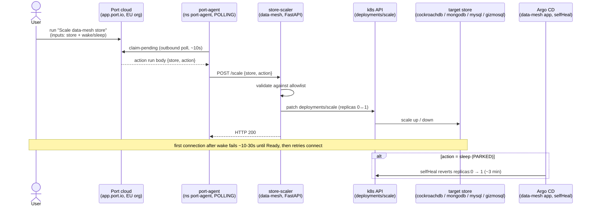

# Flow — Store scaler (Port → port-agent → store-scaler → k8s)

The reusable **Port → cluster** execution path, built for a store wake/sleep button (2026-07-02). Port is SaaS
(EU org) and the lab is LAN-only, so Port's cloud **cannot reach inbound** — the same wall as GitHub push
webhooks. The self-hosted **port-agent** solves it by connecting **outbound** to Port and **polling** for action
runs (~10s latency), then POSTing the resolved `{store, action}` payload to the in-cluster **store-scaler**
(FastAPI), which validates against an allowlist and patches `deployments/scale`. Only rarely-queried `data-mesh`
stores are in the set — `cockroachdb`, `mongodb`, `mysql`, `gizmosql` (all `Deployment`, replicas 1, `Recreate`).
The plumbing is generic: any "click a Port button → do X in the cluster" reuses it. See
[../runbooks/port-agent-easy-button.md](../runbooks/port-agent-easy-button.md), [../runbooks/keda.md](../runbooks/keda.md),
[../schedules.md](../schedules.md).

**Sleep is PARKED:** the button works end-to-end (verified: sleep → `replicas: 0`, HTTP 200), but the `data-mesh`
Argo app's `selfHeal` reverts `replicas: 0` back to the manifest's `1` within ~3 min. Making sleep stick needs an
`ignoreDifferences` carve-out on `/spec/replicas`; the execution plumbing is the keeper, not the sleep feature.

## Sequence

**Gotcha chain (each cost a loop):** `STREAMER_NAME: POLLING` not KAFKA (no Kafka creds → crashloop) · EU org →
`PORT_API_BASE_URL: https://api.port.io` (US default 403s `claim-pending`) · **Organization** creds not Personal
(Personal 403 on run-claiming) · the action needs a templated `body` or inputs arrive `null` · Helm config change
needs a `rollout restart deploy/port-agent` to remount.
