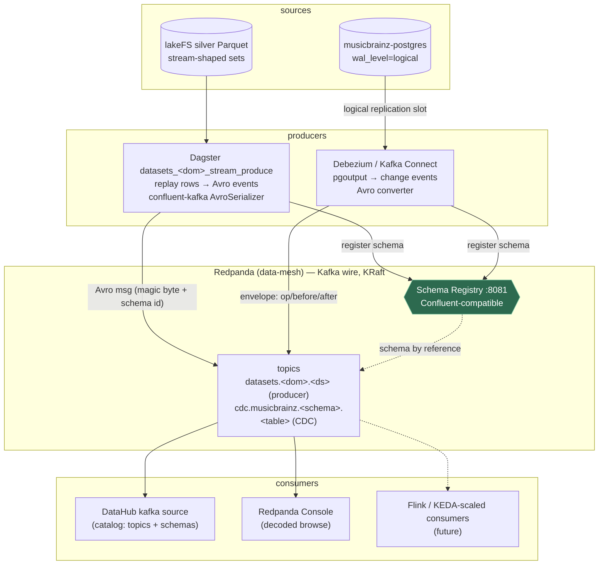
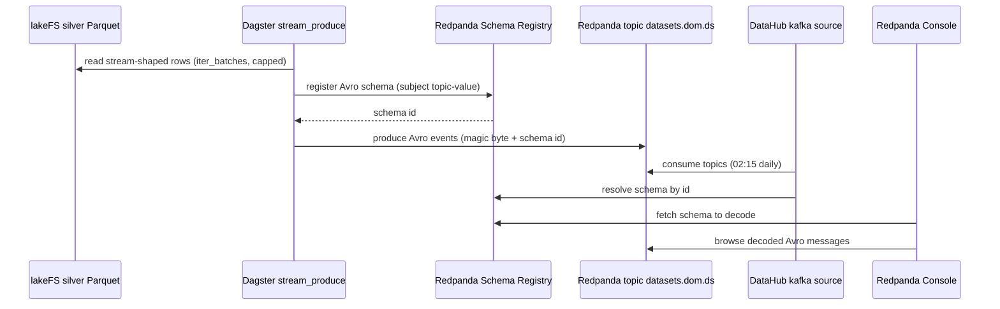

# Flow — Streaming tier (Redpanda: Avro producer + Debezium CDC + catalog)

The B1.5 streaming data plane. **Redpanda** is the Kafka-wire broker (single binary, KRaft, built-in Schema
Registry) that serves *two* producers into event topics, both Avro-serialized against **one** registry, then
consumed by the catalog + UIs. It's a different shape from the batch Tier-2 stores: those are silver → table
(state); this is silver/DB-changes → **topics** (events). See [flow-cdc.md](flow-cdc.md) for the CDC internals
and [runbooks/streaming.md](../runbooks/streaming.md).

**The two producers, one registry, one wire format:**

| Path | Producer | Source | Topics | Cadence |
|---|---|---|---|---|
| **Event replay** | `datasets_<dom>_stream_produce` (Dagster) | stream-shaped silver (lastfm, big_five, brfss, nhis) | `datasets.<dom>.<ds>` | on-demand (hydrate job), capped replay |
| **CDC** | Debezium Postgres connector (Kafka Connect) | musicbrainz-postgres `public.cdc_demo` | `cdc.musicbrainz.public.cdc_demo` | continuous (WAL tail) |

Both serialize **Avro in Confluent wire format** — a 5-byte prefix (magic byte `0x00` + 4-byte schema id) then
the Avro payload — registering the schema **once** in the shared registry (subjects `<topic>-value` / `-key`).
So every consumer (Console, DataHub, a future Flink job) decodes any topic against the same registry. That's
the whole reason Avro+registry beats embedding the schema in each message (which the CDC JSON v1 did — huge
events; see [flow-cdc.md](flow-cdc.md)).

**Why Redpanda, not DataHub's internal Kafka:** DataHub ships a KRaft Kafka for its own metadata bus (MCL/MAE).
Streaming *our* data through it would couple the pipeline to DataHub's churn (a GMS reset would nuke our
topics + CDC offsets). Dedicated Redpanda keeps the data plane isolated — same call as the "ES as its own
service" B1.3 decision. DataHub instead just *reads* Redpanda via the native `kafka` source (the catalog arrow).

## Sequence

The event-replay path (`datasets_<dom>_stream_produce`); the CDC path has its own in
[flow-cdc.md](flow-cdc.md). See [../demos/streaming.md](../demos/streaming.md).

