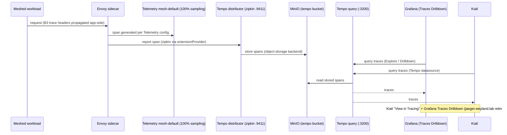

# Flow: Distributed Tracing Pipeline (B8; → Tempo since B48)

Why a trace shows up in Grafana/Kiali — and why it's easy to half-wire. **Sampling alone emits nothing**:
it needs the meshConfig `extensionProvider` (zipkin) + a `Telemetry` resource selecting that provider +
a **sidecar restart** to pick up the bootstrap. Trace context (B3 headers) must be propagated by the app
across hops or each call starts a new trace. **Jaeger was retired in B48 (2026-06-21)** — spans now land in
**Tempo** (monolithic → MinIO); Grafana (Traces Drilldown) and Kiali both read from Tempo. `jaeger.weyland.lab`
is gone.

