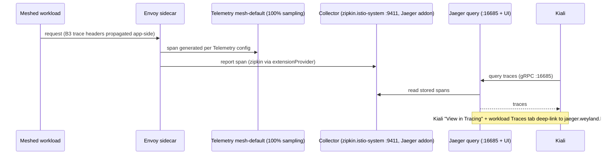

# Flow: Distributed Tracing Pipeline (B8)

Why a trace shows up in Jaeger/Kiali — and why it's easy to half-wire. **Sampling alone emits nothing**:
it needs the meshConfig `extensionProvider` (zipkin) + a `Telemetry` resource selecting that provider +
a **sidecar restart** to pick up the bootstrap. Trace context (B3 headers) must be propagated by the app
across hops or each call starts a new trace.

