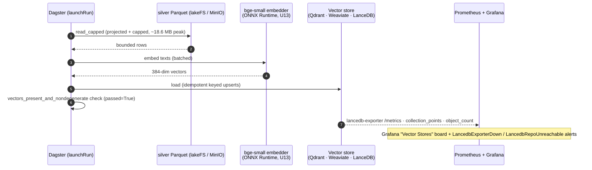

# Flow: Vector stores — OFF hydration + quality + observability (B78)

Bounded read → embed → load into three vector backends, kept under the pod memory ceiling by a projected + capped read
(the whole-file read used to OOM). U13: the embed step runs bge-small on raw ONNX Runtime now — byte-equivalent, no re-hydration.

Demo: [demos/vector-stores.md](../demos/vector-stores.md).
