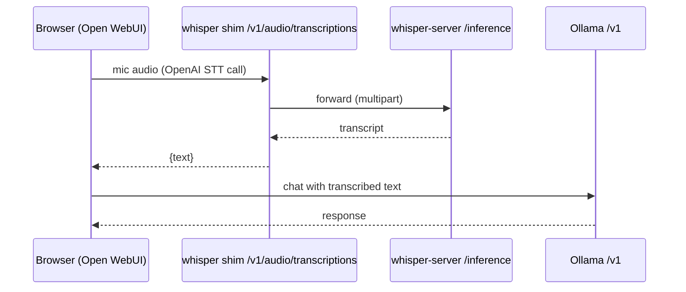

# Flow: Voice Chat (Open WebUI -> whisper -> Ollama)

```mermaid
sequenceDiagram
    participant U as Browser (Open WebUI)
    participant Shim as whisper shim /v1/audio/transcriptions
    participant WS as whisper-server /inference
    participant OLL as Ollama /v1
    U->>Shim: mic audio (OpenAI STT call)
    Shim->>WS: forward (multipart)
    WS-->>Shim: transcript
    Shim-->>U: {text}
    U->>OLL: chat with transcribed text
    OLL-->>U: response
```
