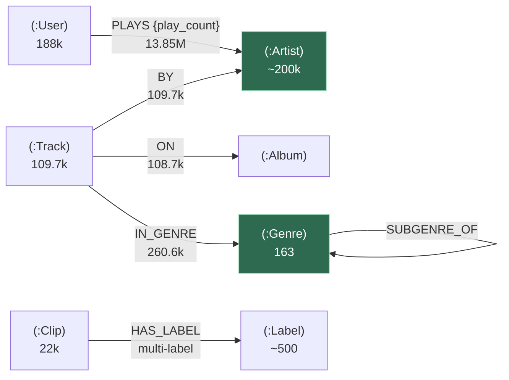

# Diagram — Neo4j music graph data model (B1)

The music-domain graph in Neo4j (`mother:30086`), built by the `datasets_lib` **GraphSpec** loader from silver
Parquet. Unlike the flat Tier-2 stores (one file → one table), Neo4j is **selective + modeled**: only
relationship-shaped datasets become graphs, and they **share node labels** so separate datasets fuse into one
connected graph. See [runbooks/datasets-hydration.md](../runbooks/datasets-hydration.md) and
[query/neo4j.md](../query/neo4j.md).

**Nodes / edges by source dataset:**

| Dataset | Nodes | Edges | Key |
|---|---|---|---|
| lastfm | `:User` (gender/age/country), `:Artist` (name) | `(:User)-[:PLAYS {play_count}]->(:Artist)` | Artist by **name** |
| fma_genres | `:Genre` (genre_title/handle/color) | `(:Genre)-[:SUBGENRE_OF]->(:Genre)` — taxonomy tree | Genre by **genre_id** (int) |
| fma_tracks | `:Track` (title/listens/…), `:Album` | `-[:BY]->(:Artist)`, `-[:ON]->(:Album)`, `-[:IN_GENRE]->(:Genre)` | Track by track_id |
| audioset | `:Clip`, `:Label` | `(:Clip)-[:HAS_LABEL]->(:Label)` | Clip by video_id |

**The two fusion points** (green nodes) are what make this one graph, not four:
- **`:Artist` (keyed by name)** is written by *both* lastfm (`PLAYS`) and fma_tracks (`BY`) — so an artist you
  listen to and an artist who has tracks are the *same node*. Query: fans of an artist ↔ that artist's tracks.
- **`:Genre` (keyed by genre_id)** is the fma_genres taxonomy tree *and* the target of fma_tracks `IN_GENRE` —
  so tracks hang off the genre hierarchy. Query: genre → its tracks → their artists → their listeners.
- **audioset (`:Clip`/`:Label`)** is a deliberately **disjoint component** (no shared entities with music).

**Not modeled:** musicbrainz (flat mbid dictionary, no inter-row edges), and the flat feature/caption sets
(spotify, fma_echonest/features, gtzan, lp_musiccaps, uci) — those live in the tabular/OLAP/vector stores.

**Loader mechanics (`datasets_lib/loaders.py`):** unique constraint per (label, key) first (MERGE without an
index is O(n)/row); clean rebuild = batched `DETACH DELETE` of the spec's `clear_labels` (fma_tracks omits the
shared `:Artist`/`:Genre` so a reload never wipes lastfm's `PLAYS` graph or the tree); then per-batch nodes
`MERGE`, edges **`MATCH`-both-endpoints + `CREATE`** (MERGE-relationship into a supernode is O(degree) — death
at lastfm scale). Multi-value columns use `dst_list` (audioset labels) / `dst_list_key` (fma_tracks
`track_genres` list-of-dicts → genre_id). Each batch is one auto-retried `execute_write` transaction.

> **Mesh gotcha:** neo4j stays in the Istio mesh; a `neo4j-bolt` DestinationRule adds TCP keepalive so Envoy
> resets a stale long-lived Bolt connection instead of half-closing it (which hung the ~14M-edge lastfm load
> forever). See [c4-component-mother.md](c4-component-mother.md).

*Separate graphs in the same DB:* the **AIDLC methodology** graph (`:Entry`/`:Stage`/`:Tag`/`:Vertical`, B37)
and the **RAG/GraphRAG** graph (`:Document`/`:Chunk`) — see [query/neo4j.md](../query/neo4j.md).
