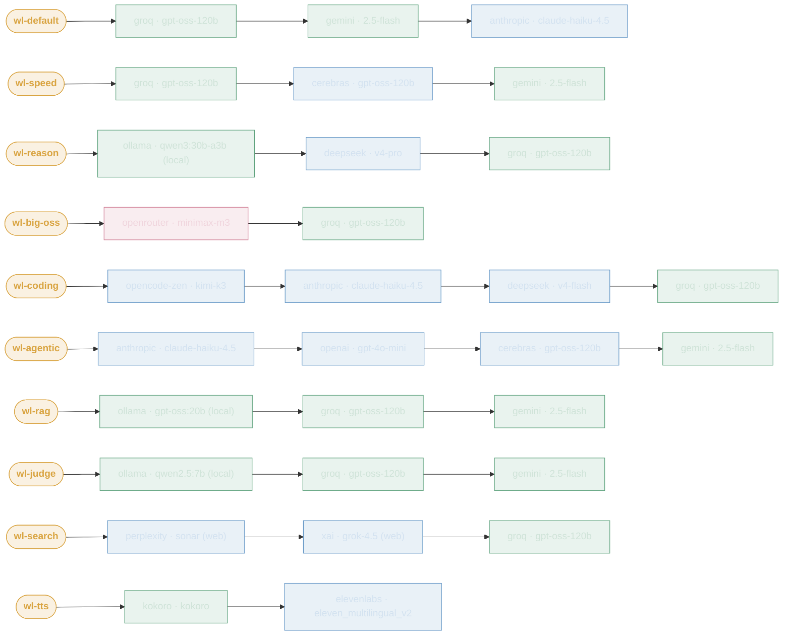

# LLM Routing

Use-case **aliases → provider fallback chains**, served by **LiteLLM**. A client sends only the alias
(e.g. `wl-coding`); LiteLLM picks the **primary** and fails over down the chain on network / 5xx / 429 /
timeout — server-side and transparent. Left node = primary; each `→` is the next fallback. Colour = cost tier.
Hosted rungs egress **through Bifrost** (LiteLLM → Bifrost → provider) for per-VK cost/usage attribution; the
local **Ollama** lanes (`wl-rag` · `wl-reason` · `wl-judge`) stay direct to rogueone.

Every chain has a **free, always-on** rung so a call lands for $0 — usually the primary, and `wl-search` now carries a
free `wl-default` (groq) tail as its guaranteed lander (a non-web answer, but it always returns). The chat lanes keep
free rungs while escalating to funded providers before that tail; the media lane `wl-tts` grounds on its free
**primary** — self-hosted Kokoro. For the full interactive view see the
**[LLM Routing Map](llm-routing-map.html)** (internal). This diagram is copy-paste-able — grab the fenced block below.

**Legend** — ■ free ($0 self-hosted / free tier) ·
■ funded (prepaid credits) ·
■ metered (pay-per-token, budget-capped) · `(local)` = rogueone GPU · `(web)` = web search.

