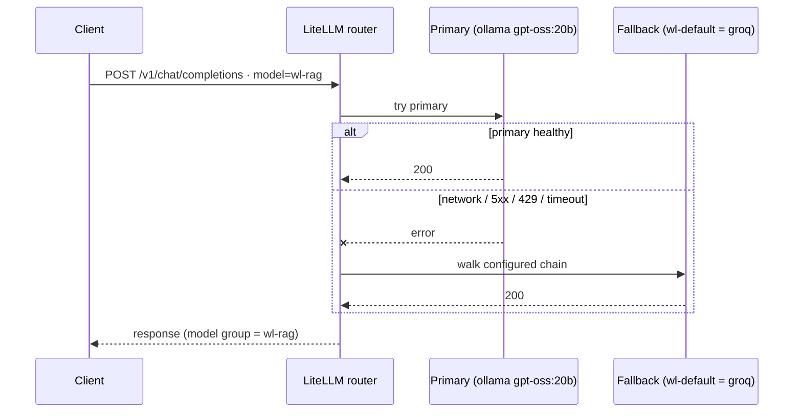

# Model Gateway (LiteLLM) + Model Catalog — runbook

**What:** a LAN **LiteLLM** proxy on mother/k3s that (1) fronts hosted-model providers behind one
OpenAI-compatible endpoint, and (2) is the platform's **use-case router (B111)** — 9 `wl-*` aliases, each a
primary model with a **server-side fallback chain** (the transparent failover Bifrost OSS gates behind its
Enterprise adaptive load-balancer — see [mcp-gateway.md](mcp-gateway.md)). Plus a Dagster `model_catalog` asset
that keeps a queryable lookup table of reachable models fresh every 6h.

**Origin:** reframed from B26 (Hermes Claude brain). The Claude-subscription path was **declined** — using a
Claude Pro/Max subscription via a proxy is a ToS gray area, and a metered Anthropic API key wasn't wanted.
API-key providers (Gemini/OpenRouter free tiers) give strong models at $0 with no ToS issue, and stand up the
unified gateway that was always on the roadmap (`requirements-analysis.md` → "LiteLLM (future)").

- Manifests: `nodes/mother/lab/weyland-platform/k8s/litellm/` (+ that dir's `README.md`).
- Catalog asset: `services/weyland-dagster/weyland_pipeline/assets/model_catalog.py`; DDL
  `scripts/model-catalog-schema.sql`; schema doc `docs/concepts/data-schema.md`.
- Endpoint: `http://mother:30400/v1` (NodePort 30400) · UI `https://litellm.weyland.lab`.

---

## 1. Deploy the gateway (on mother)

Keys (both free): **Gemini** → aistudio.google.com/apikey (no billing — the Cloud project is just a
container) · **OpenRouter** → openrouter.ai/keys.

Create the secret from a file (avoids shell-wrapping the long keys):
```
nano /tmp/litellm.env
```
Three lines:
```
GEMINI_API_KEY=...
OPENROUTER_API_KEY=...
LITELLM_MASTER_KEY=<any random string Hermes/consumers present to the proxy>
```
```
kubectl delete secret litellm-secrets -n weyland --ignore-not-found
```
```
kubectl create secret generic litellm-secrets -n weyland --from-env-file=/tmp/litellm.env
```
```
shred -u /tmp/litellm.env
```
Apply the manifests:
```
kubectl apply -f configmap.yaml -f deployment.yaml -f service.yaml -f servicemonitor.yaml -f ingress.yaml -f prometheusrule.yaml
```
```
kubectl rollout status deploy/litellm -n weyland
```

## 1b. Use-case router — `wl-*` aliases + fallback chains (B111)

Clients send a **use-case alias** as the `model` and LiteLLM routes it to a primary, failing over down a
**server-side chain** on `network / 5xx / 429 / timeout`. Config: the `model_list` (primaries) +
`router_settings.fallbacks` (chains) in `k8s/litellm/configmap.yaml`. Visual: **[LLM Routing Map](../llm-routing-map.html)** (internal).

| Alias | Primary | Fallback chain (→ order) |
|---|---|---|
| `wl-default` / `wl-speed` | groq `gpt-oss-120b` (free) | → gemini-flash → anthropic *(speed: → cerebras → gemini)* |
| `wl-coding` | opencode-zen `kimi-k3` (funded, tools) | → anthropic → deepseek → groq |
| `wl-agentic` | anthropic `claude-haiku-4.5` (tools) | → openai → cerebras → gemini |
| `wl-rag` / `wl-judge` | ollama local (`gpt-oss:20b` / `qwen2.5:7b`) | → groq → gemini |
| `wl-reason` | ollama `qwen3:30b-a3b` (local) | → deepseek-reasoner → groq |
| `wl-search` | perplexity `sonar` (web) | → xai grok |
| `wl-big-oss` | openrouter `minimax-m3` | → groq |

**How it works.** Provider keys come from `envFrom: bifrost-provider-keys` (the shared sealed secret — reused, not
re-sealed). Self-hosted: ollama = `api_base: http://192.168.1.230:11434` (rogueone, no key); opencode-zen =
`openai/kimi-k3` + `api_base: https://opencode.ai/zen/v1`. Fallback rungs reference other `model_name`s — aliases
(`wl-default`=groq, `wl-agentic`=anthropic) are reused as rungs so the always-on-free tier is defined once. Each chain
**ends in a free rung** so it can never hard-fail; a dry paid provider (402/429) is **skipped by cost management**, not
an error — the router walks on.



**Add / change a route.** Edit `model_list` (a primary) or `router_settings.fallbacks` (a chain) in
`configmap.yaml`, then **push → Argo sync** (LiteLLM is Argo-managed with `selfHeal:true`, so a direct `kubectl apply`
gets **reverted** — it must go through git). The deployment change or a `kubectl rollout restart deploy/litellm` reloads
the config.

**Demo / verify** (from inside the pod, using its own master key — never printed):
```
kubectl -n weyland exec -i deploy/litellm -- python - <<'PY'
import os, httpx
h={"Authorization":"Bearer "+os.environ["LITELLM_MASTER_KEY"]}
for m in ["wl-default","wl-coding","wl-rag","wl-search","wl-big-oss"]:
    r=httpx.post("http://localhost:4000/v1/chat/completions",headers=h,
      json={"model":m,"messages":[{"role":"user","content":"one word"}],"max_tokens":256},timeout=80)
    j=r.json(); print(m, r.status_code, j.get("model"),
        r.headers.get("x-litellm-model-api-base"))
PY
```
The `x-litellm-model-api-base` header reveals the **actual deployment** served (ollama `.230` vs `api.groq.com`, …).

**Prove a fallback fires** (force the primary to fail — note: `mock_testing_fallbacks` is a Python-Router hook, **not**
honored via the HTTP proxy, so drive the Router directly with the live config):
```
kubectl -n weyland exec -i deploy/litellm -- python - <<'PY'
import yaml, asyncio
from litellm import Router
cfg=yaml.safe_load(open("/etc/litellm/config.yaml"))
r=Router(model_list=cfg["model_list"], fallbacks=cfg["router_settings"]["fallbacks"])
out=asyncio.run(r.acompletion(model="wl-rag", messages=[{"role":"user","content":"hi"}],
    max_tokens=20, mock_testing_fallbacks=True))
print("served by:", out._hidden_params.get("api_base"))   # -> https://api.groq.com/... (wl-default rung)
PY
```

## 2. Smoke tests (on mother)

Pull the master key from the secret (no placeholder):
```
MK=$(kubectl get secret litellm-secrets -n weyland -o jsonpath='{.data.LITELLM_MASTER_KEY}' | base64 -d)
```
Model list served by the gateway:
```
curl -s http://192.168.1.243:30400/v1/models -H "Authorization: Bearer $MK" | head -c 400; echo
```
A real completion through Gemini:
```
D='{"model":"gemini-flash","messages":[{"role":"user","content":"say hi in 3 words"}]}'
```
```
curl -s http://192.168.1.243:30400/v1/chat/completions -H "Authorization: Bearer $MK" -H "Content-Type: application/json" -d "$D" | head -c 500; echo
```
Confirm the scrape works (metrics target up):
```
kubectl exec -n monitoring "$(kubectl get pod -n monitoring -l app.kubernetes.io/name=prometheus -o name | head -1)" -c prometheus -- promtool query instant http://localhost:9090 'up{job="litellm"}'
```

## 3. Cut-off valve (human-only; agent cannot reach it)

The valve lives on mother (k3s control plane) — Hermes has no kubectl and `/mcp-act` doesn't expose it.
```
./valve.sh close     # scale to 0 — stops all off-LAN model calls (drops in-flight)
./valve.sh open      # scale to 1
./valve.sh status
```
The `LiteLLMEgressEnabled` alert (Telegram, via B5 Alertmanager) fires the whole time replicas > 0, so you
can't forget the valve is open.

## 4. Wire Hermes (CT 104) — optional, default stays local

Add a `custom` provider via `hermes model` (writes the correct schema — do **not** hand-edit `config.yaml`):
base_url `http://192.168.1.243:30400/v1`, api_key = `LITELLM_MASTER_KEY`, model e.g. `gemini-flash`,
api_mode `chat_completions`. Default stays `qwen3-coder:30b`; escalate a turn with `/model <name> --provider <n>`.
**Never** add it to `fallback_providers` or the `auxiliary` lanes (those must stay local — see §6).

---

## 5. Model catalog (Dagster asset, 6h)

Keeps the `model_catalog` table fresh: OpenRouter (free flag from pricing) + Gemini + local Ollama,
**replace-by-source** each run. Resilient: one source failing doesn't sink the others.

**Deploy the asset** (it's baked into the `weyland-dagster-user-code:local` image):
```
# [rogueone] ship the whole package dir (rsync -a preserves subdirs)
rsync -a services/weyland-dagster/weyland_pipeline emangini@mother:~/lab/weyland-platform/services/weyland-dagster/
rsync -a k8s/dagster/user-code.yaml emangini@mother:~/lab/weyland-platform/k8s/dagster/
```
```
# [mother] verify the shipped files BEFORE building (stale-source guard)
grep -c weyland_catalog_job ~/lab/weyland-platform/services/weyland-dagster/weyland_pipeline/schedules/__init__.py   # expect 3
cat ~/lab/weyland-platform/services/weyland-dagster/weyland_pipeline/__init__.py                                     # expect: from weyland_pipeline.definitions import defs
```
```
# [mother] build user-code image, import into k3s, apply env change, roll
cd ~/lab/weyland-platform/services/weyland-dagster
docker build -t weyland-dagster-user-code:local .
docker save weyland-dagster-user-code:local | sudo k3s ctr images import -
kubectl apply -f ~/lab/weyland-platform/k8s/dagster/user-code.yaml
kubectl rollout restart deploy/dagster-user-code -n weyland && kubectl rollout status deploy/dagster-user-code -n weyland
```
The `GEMINI_API_KEY` env on `dagster-user-code` reads from `litellm-secrets` (enables the Gemini source;
OpenRouter + Ollama need no key).

**Populate now + enable the schedule:**
```
kubectl exec -n weyland deploy/dagster-user-code -- dagster asset materialize --select model_catalog -m weyland_pipeline.definitions
```
Then flip on `weyland_catalog_schedule` (cron `0 */6 * * *`) in the Dagster UI (Automation → Schedules).

**Query it** — counts per source:
```
kubectl exec -i -n weyland deploy/weyland-postgres -- psql -U weyland -d weyland -c "SELECT source, count(*), count(*) FILTER (WHERE free) AS free FROM model_catalog GROUP BY source;"
```
The guess-free list of **free OpenRouter** slugs you can pass through the gateway:
```
kubectl exec -i -n weyland deploy/weyland-postgres -- psql -U weyland -d weyland -c "SELECT model_id, context_length FROM model_catalog WHERE source='openrouter' AND free ORDER BY context_length DESC NULLS LAST;"
```
First populated run (2026-06-17): openrouter 336 (26 free) · gemini 37 (`free` stored NULL — free tier is
account-level) · ollama 6 (6 free).

---

## 6. Auxiliary lanes pinned local (Hermes safety, done 2026-06-17)

Independent of the gateway but part of the same work: Hermes's `auxiliary.*` tasks defaulted to
`provider: auto`, which could route background calls (title-gen, etc.) off-LAN to Nous/cloud. Pinned the
text lanes (`title_generation`, `web_extract`, `compression`, `skills_hub`, `approval`) to the local Ollama
in `~/.hermes/config.yaml` so nothing background ever leaves the LAN:
```
    provider: custom
    model: qwen3-coder:30b
    base_url: http://192.168.1.230:11434/v1
    api_key: ollama
```
`vision` is the one unpinned lane (needs a local *vision* model). Verify no off-LAN auxiliary calls:
```
pct exec 104 -- bash -lc "journalctl -u hermes-gateway --no-pager -n 80 | grep -iE 'auxiliary|401|nous' || echo clean"
```

---

## Troubleshooting (gotchas hit during bring-up)

- **Pod `CrashLoopBackOff`, exit 137 (`OOMKilled`):** LiteLLM spikes on startup; 512Mi is too tight. The
  deployment sets `limits.memory: 2Gi`. Symptom: `kubectl describe pod … State: Terminated Reason: OOMKilled`.
- **`/metrics` scrape `up=0`, curl returns 401 "Malformed API Key":** with a `master_key` set, LiteLLM
  auth-gates `/metrics`. Fixed by `litellm_settings.require_auth_for_metrics_endpoint: false` (LAN-only) in
  `configmap.yaml`. The **gate-open alert needs no LiteLLM metrics** (uses kube-state-metrics), so it works
  regardless; only the spend alert depends on `/metrics`.
- **OpenRouter free model returns 429 "rate-limited upstream":** the *key works* (it routed to a provider);
  free pools are shared/flaky. Retry, pick another free slug (from the catalog query above), or add a little
  OpenRouter credit for priority.
- **Dagster user-code `ImportError` after deploy (e.g. `cannot import name 'weyland_catalog_job'`):**
  stale source — `rsync -a` preserves directory structure (no basename/parent-dir clobber), but rsync into
  an existing dir does NOT remove stale files unless you pass `--delete` or copy changed files by explicit
  path. So sync the whole `weyland_pipeline` dir with `rsync -a` and `grep`-verify on mother before
  building.

## Privacy / cost

Free tiers (Gemini free, OpenRouter `:free`) may log/train on prompts and are off-LAN — fine for lab
escalation, not for anything sensitive. Paid OpenRouter routes don't train but cost money — watch the
`LiteLLMSpendObserved` alert and OpenRouter's account credit limit.
