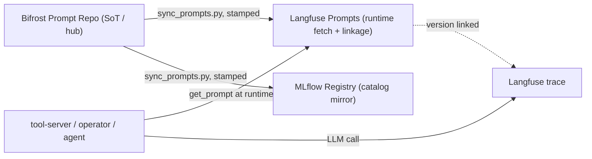

# Prompt Federation (B103)

**Bifrost = the single source of truth for prompts.** Author/manage every prompt in the Bifrost Prompt Repository;
it syncs OUT to **Langfuse** (runtime fetch + trace linkage) and **MLflow** (catalog mirror); the apps fetch from
Langfuse at runtime, so **every LLM trace is tagged with the exact prompt version that produced it**. Design:
`../design/prompt-federation-design.md`. Memory: `prompt-federation-b103`.

## Why this shape

Linkage is created at **fetch time**, not author time — so the source of truth (Bifrost) is orthogonal to where the
linkage lives (Langfuse). Author in Bifrost, fetch from the Langfuse mirror, and you get both: one management surface
*and* prompt→trace linkage in the observability tool. Edit a prompt → re-sync → new version → new traces link the new
version → compare v1 vs v2 on real traffic + scores.



## Edit a prompt (the everyday flow)

1. **Author in Bifrost** — the Prompt Repository UI (or `register_bifrost_prompts.py` for the durable, GitOps set;
   app prompts live in the `app-integrated` folder). Bifrost is model-agnostic (`{{var}}` mustache variables,
   auto-extracted).
2. **Sync out** — run the mirror (on mother):
   ```
   kubectl -n weyland exec deploy/dagster-user-code -- python /app/scripts/sync_prompts.py
   ```
   Idempotent: only prompts whose content changed get a new downstream version (hash-compared vs the current
   `production`). Expect `Langfuse: N upserted, M unchanged` / `MLflow: …`.
   **NOTE:** this exec is the fast on-demand path. As of Phase 2 the sync also runs automatically as the
   `prompt_federation_synced` asset in the Dagster `registrations` group (weekly + on-demand), so a Bifrost edit
   propagates on the next reconcile without the manual exec.
3. **Apps pick it up** — the apps fetch `production` at runtime (TTL-cached), so a new version hot-swaps within the
   cache TTL, no redeploy.

## The normalizer (three stores model prompts differently)

`sync_prompts.py` is a normalizer, not a copy:
- **Bifrost & Langfuse:** chat messages `[{role,content}]`, `{{var}}`.
- **MLflow:** plain-string template, `{var}` (`str.format`). So Bifrost→MLflow flattens messages + translates
  `{{v}}`→`{v}`.

Uses the Langfuse **REST API via httpx** (`GET/POST /api/public/v2/prompts`, Basic auth pk/sk) — **NOT the langfuse
SDK**, because the SDK's `packaging<26` pin conflicts with the dagster image's `packaging==26.2`. Creds reuse the
already-sealed `litellm-secrets` `LANGFUSE_PUBLIC_KEY`/`SECRET_KEY`. Every propagated version is stamped
`synced-from-bifrost:<hash>` (Phase-2 loop prevention).

## Runtime linkage (per app)

Each app runs Langfuse tracing **alongside** its existing MLflow spans (nothing removed) via a fail-safe
`_lf_generation` contextmanager: `Langfuse()` (v4 SDK) → `get_prompt(name, type="chat")` →
`start_as_current_observation(as_type="generation", model=, input=, prompt=<obj>)` → `.update(output=)` → flush. The
`prompt=` param is the link. Wired in:

| App | Image | Prompt(s) linked |
|---|---|---|
| weyland-tool-server (`main.py`, `/context/ask`) | v16 | `rag_system` |
| weyland-operator (`agent.py`, `run()`) | v21 | `operator_system` (both ReAct invokes) |
| weyland-agent (`graph.py`) | v5 | `agent_grade`, `agent_reflect`, `rag_system` |

Each is a separate loose-pip image, so the `langfuse` SDK drops in (the packaging conflict is ONLY the dagster
lockfile). Env per app: `LANGFUSE_HOST`, `LANGFUSE_PUBLIC_KEY`/`SECRET_KEY` (from `litellm-secrets`),
`OTEL_SERVICE_NAME` (else the trace shows `service.name: unknown_service`).

## Verify

- **Synced:** Langfuse → `platform` → Prompts shows the prompt; `GET /api/public/v2/prompts/<name>` returns it.
- **Linked:** exercise an app (e.g. `POST /context/ask`), open the trace in Langfuse → the generation header shows a
  `Prompt: <name> - vN` chip (clickable → all traces on that version).

## Gotchas

- **langfuse SDK vs REST:** SDK 3.x/4.x caps `packaging<26` → conflicts with the dagster mega-lockfile. Use REST for
  the sync (dagster image); the SDK is fine in the light app images.
- **SDK v4** (not v3): tracing is `start_as_current_observation(as_type="generation")`, not `start_generation`.
- **`unpigz: invalid deflate data`** on build (rogueone `unpacking`) OR on the node (`ErrImagePull … failed to extract
  layer`) = an **oversized single layer** tripping a buildkit gzip defect — the layer is written as malformed gzip. It is
  **NOT** a cache/disk/prune problem (`prune -af` + `--no-cache` do nothing; `--push` just moves the bad layer to the
  registry). Diagnose: `curl -sk https://registry.weyland.lab/v2//blobs/<digest> | gzip -t` — gzip fails but the
  sha matches ⇒ corrupt at build. Fix: shrink/split the layer (e.g. tool-server's 3 GB CUDA-torch layer → CPU-only
  `torch --index-url https://download.pytorch.org/whl/cpu`, 258 MB) and push a fresh tag. Full detail:
  [[buildkit-large-layer-corruption]].

## Phase 2 (✅ DONE 2026-08-10 — bidirectional + auto)

`sync_prompts.py` now runs `reconcile_inbound()` FIRST (pull native edits back to Bifrost), then re-reads Bifrost and
mirrors outbound — bidirectional in one pass.

- **Inbound reconcile:** native edits made *in* Langfuse (playground) / MLflow flow back to Bifrost. Loop-safety =
  content-hash compare + a `synced-from-bifrost:<hash>` provenance stamp; conflict = **last-write-wins by timestamp**
  (with a WARNING). **GOTCHA:** native-edit detection keys on the VERSION-level **`commitMessage`**, NOT Langfuse
  **`tags`** — Langfuse tags are PROMPT-level (sticky across every version), so a native edit inherits v1's
  `synced-from-bifrost` tag and checking tags would falsely skip it (the Part-A bug: `Inbound: 0`, then outbound
  clobbered the native edit; keying on `commitMessage` fixed it → `Inbound: 1`).
- **Auto-reconcile:** wired as the `prompt_federation_synced` asset in the Dagster `registrations` group (downstream of
  `bifrost_prompts_registered`; user-code image v41), so it runs on the weekly + on-demand reconcile — no manual exec.
  The asset must be added to BOTH the import and the explicit `all_assets` list in `weyland_pipeline/assets/__init__.py`
  or it silently won't load.
